# 基于深度学习的A股股票排序预测与模拟交易 — 实验报告（初稿）

> **项目名称**: deep-learning2026final-lab — 过拟合散户小组
> **负责人**: li | 成员: wu, wang
> **实验日期**: 2026年5月25日 – 6月14日
> **模拟交易竞赛**: 2026年6月1日 – 6月12日

---

## 摘要

本项目旨在构建一个基于深度学习的A股股票排序预测系统，预测T+1日收益率的横截面排序，驱动"每日买入得分最高的K只、卖出持仓中得分最低的K只"的轮动交易策略。经过V1至V9共九个版本的迭代，最终确定**v7 Spatial (T+1标签, GRU+SparseSpatialAttention, d=32, K=5)** 为最优模型，在验证集（2025年）上达到Rank IC=**0.1062**，在测试期（2026年1月5日–5月29日，94个交易日）上实现含成本累计净收益**+65.83%**（超额收益+59.61% vs CSI300），夏普比率**5.59**。本文档详细记录了从V1到V9九个版本的完整实验历程，包括所有技术路径的探索、架构尝试的成败分析、以及关键设计决策的推理过程。

---

## 一、问题定义与数据预处理

### 1.1 任务定义

**预测目标**: 给定股票 `i` 在交易日 `t` 的过去 `T=60` 个交易日的特征序列 $\mathbf{X}_{i,t} \in \mathbb{R}^{T \times D}$，预测其在 `t+1` 日的收益率排序得分 $s_{i,t+1}$。

**交易策略**: T+1轮动——每日卖出当前持仓中得分最低的 `K` 只股票，买入全市场得分最高的 `K` 只股票。推荐参数范围：持仓数 `N=5-30`，轮换数 `K=1-5`。

**优化目标**: 直接优化横截面排序质量（而非精确预测收益率数值）。

### 1.2 数据来源

| 数据类别 | 来源路径 | 内容 | 特征维度 |
|---------|----------|------|:---:|
| 基础量价 | `data/daily/*.csv` | OHLCV + 成交额 + 换手率 | 10 |
| 基本面指标 | `data/metric/*.csv` | PE/PB/流通市值等 | 3 (精选) |
| 资金流向 | `data/moneyflow/*.csv` | 大/中/小单买卖净额 (V8尝试) | 19 |
| 市场指数 | `data/market/000300.SH.csv` | CSI300日收益率 | — |
| 股票基础信息 | `data/basic.csv` | 代码/名称/行业/上市日期 | — |

**数据范围**: 2016年–2026年5月，约4959只股票 × 2526个交易日。

### 1.3 特征工程演化

| 版本 | 特征维度 | 组成 | Val IC (GRU) |
|:---:|:---:|------|:---:|
| V1 | 10 | 仅量价(OHLCV+vol+amount) | 0.1042 |
| V2 | 22 | +8技术指标(MACD/RSI/布林带/动量) +4截面特征 | 0.1029 |
| V5 | 26 | +vwap_gap +3估值特征(rank_pe/rank_pb/rank_circ_mv) | **0.1114** (T+5) |
| V8 | 31 | +2资金流(mf_flow_hhi, mf_sm_lg_div) +3 Tier1(amihud_20, ret_skew_20, price_pos_20) | 0.1037 (退化) |

**最终使用的26维特征**（V5-V7）:

| 组别 | 特征 | 数量 | 归一化方式 |
|------|------|:---:|------|
| 量价 | open, high, low, close, vol, amount, pct_chg, turnover_rate, volume_ratio, total_mv, vwap_gap | 11 | Per-window Z-score (沿T轴) |
| 技术指标 | macd, macd_signal, rsi, bb_width, bb_pct, mom_5, mom_20, vol_20 | 8 | Per-window Z-score (沿T轴) |
| 截面特征 | rank(pct_chg), rank(amount), rank(turnover_rate), rel_beta | 4 | Per-date Z-score (沿N轴) → tile |
| 估值截面 | rank(pe), rank(pb), rank(circ_mv) | 3 | Per-date Z-score (沿N轴) → tile |

> **关键技术节点 (V5)**: 发现V2中四个截面特征因tile后Z-score归一化导致全部退化为零——模型在18个有效特征上训练。V5通过两阶段归一化修复此bug：时序特征per-window Z-score，截面特征per-date Z-score后tile。bug修复后Val IC从0.1029提升至0.1114 (+8.2%)。

### 1.4 标签构造

| 版本 | 标签定义 | 发现 |
|:---:|------|------|
| V1-V2 | T+1 单日收益率 `pct_chg[t+1]` | — |
| V5-V6 | **T+5 累计收益率** `sum(pct_chg[t+1:t+6])` | 虚假繁荣：Val IC=0.111，Test T+5 IC=0.010 |
| V7-V9 | **T+1 单日收益率** (回归) | Test T+1 IC=0.048-0.053，诚实且有效 |

> **关键发现 (V6→V7)**: T+5标签的Val IC 0.111是动量延续溢价造成的虚假繁荣——模型实际学到的是T+1动量模式（训练期2019-2025动量延续到5日范围），在2026年动量断裂后Test T+5 IC暴跌至0.010。回归T+1标签后，Test IC稳定在0.048-0.053。

### 1.5 数据集划分与标准化

- **训练集**: 2019年1月 – 2024年12月（约1456个交易日）
- **验证集**: 2025年1月 – 2025年12月（243个交易日）
- **测试期**: 2026年1月5日 – 5月29日（94个交易日，回测）/ 6月1日–12日（竞赛实战）
- **划分原则**: 严格时间序列划分，**禁止随机打乱**
- **标准化**: 每个滑动窗口实例内独立Z-score标准化，杜绝未来信息泄露

### 1.6 交易成本模型

| 费用 | 卖出（/支） | 买入（/支） |
|------|:---:|:---:|
| 印花税 | 0.05% | — |
| 佣金（万2.5） | 0.025% | 0.025% |
| 过户费 | 0.001% | 0.001% |
| **单边合计** | **0.076%** | **0.026%** |

采用**净值成本模型**: 成本按净变化计算（同股买卖不计费），分摊至N只持仓。

### 1.7 硬件环境

| 组件 | 配置 |
|------|------|
| GPU | NVIDIA RTX 4060 Laptop 8GB VRAM |
| RAM | 32GB |
| OS | Windows + WSL2 (代码编辑在WSL, 训练走PowerShell调用Windows GPU) |
| PyTorch | 2.6.0+cu124 (Windows原生, conda环境`dl_lab1`) |
| CUDA内存 | `max_split_size_mb:128` (WDDM模式) |

---

## 二、模型架构探索与迭代（V1-V9）

### 2.1 版本总览

| 版本 | 核心贡献 | 最优Val IC | Test IC/OOS表现 | 状态 |
|:---:|------|:---:|------|:---:|
| V1 | GRU基线搜索 | 0.1042 | — | ✅ 基线 |
| V2 | 特征扩展(22维) + 多模型对比(GRU/TF/MLP) | 0.1029 | 回测+6.85% (Feb-May) | ✅ 早期最优 |
| V3 | 策略回测 + Strategy B止损机制 | — | Sharpe 0.93 (with Strategy B) | ✅ 策略锚定 |
| V4 | 多窗口集成可行性 → **放弃** | — | T=90冗余, T=30劣于T=60 | ❌ 放弃 |
| V5 | 截面特征bug修复 + 预处理 → **Val IC +8.2%** | 0.1114 (T+5) | Test T+1 IC≈0.053 | ✅ 突破 |
| V6 | 空间注意力验证 (V1失败→V2成功) + **T+5标签危机发现** | 0.1134 (T+5) | Test T+1 IC=0.051 | ⚠️ 架构有用, 标签有问题 |
| V7 | **T+1标签重训** → 当前最优 | **0.1062** (T+1) | **+65.83% net** (N=5,K=3) | 🏆 **最优** |
| V8 | 特征扩展(31dim) + 行业emb + 损失对比 → **全面失败** | 0.1037 | +1.80% (回测暴跌64%) | ❌ 失败 |
| V9 | 售卖模型 + Jan效应 + Fine-tune → **无增量** | — | — | ❌ 证伪 |

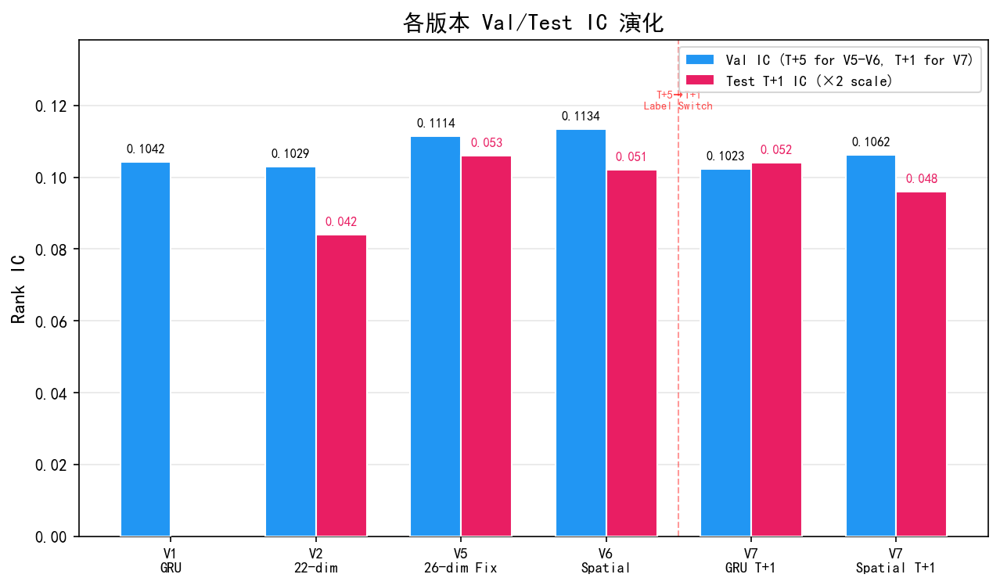

---

### 2.2 V1 — GRU基线搜索

**目标**: 在10维原始量价特征上，建立GRU基线模型。

**实验设计**: 对 `T×H×L×D×lr` 做超参数扫描。
- `T ∈ {60}`, `H ∈ {64, 128}`, `L ∈ {1, 2}`, `D ∈ {0.1, 0.2, 0.3}`
- `lr ∈ {5e-4, 1e-3}`

**结果**:

| 最优配置 | 值 |
|------|:---:|
| T=60, H=128, L=2, D=0.1, lr=5e-4 | — |
| Val Rank IC | **0.1042** |

**结论**: GRU在10维原始特征上已能学习到有效的排序信号。Val IC > 0.10证明深度学习在A股排序任务上可行。

---

### 2.3 V2 — 多模型对比与特征扩展

**目标**: 引入技术指标和截面特征（22维），对比GRU、Transformer、MLP三类架构。

**训练结果**:

| 模型 | 最优配置 | Val IC | 参数量 |
|------|------|:---:|:---:|
| **GRU** | H=128, L=1, D=0.2, lr=3e-4 | **0.1029** | 68,225 |
| TF | d=96, heads=4, nt=2, ns=1, D=0.1 | 0.1009 | ~130K |
| MLP | hidden=1024, n=4, D=0.3 | 0.0843 | ~4M |

**关键发现**:
1. **GRU > Transformer**: TF的时间自注意力在金融小数据集上（1456天训练）不如GRU的门控机制——attention过度灵活导致过拟合
2. **L=1 > L=2**: 特征从10维扩展到22维后，单层GRU优于双层，更丰富的特征下深层更容易过拟合
3. **MLP显著劣于序列模型**: 扁平化60天时序 → 1024维输入的MLP无法有效捕捉时序依赖

**集成尝试（均失败）**:

| 方案 | 结果 | 原因 |
|------|------|------|
| GRU+TF异构集成 (6:4) | OOS -0.78% | TF加入噪声多于信号 |
| GRU×5种子集成 | 秩相关 ~0.95 | 伪多样性 |

**V2后续（V3辅助）**: 在2026年Feb-May测试期上，GRU + Strategy B实现+6.85%累计收益（超额CSI300 +6.85%），Sharpe 0.93。

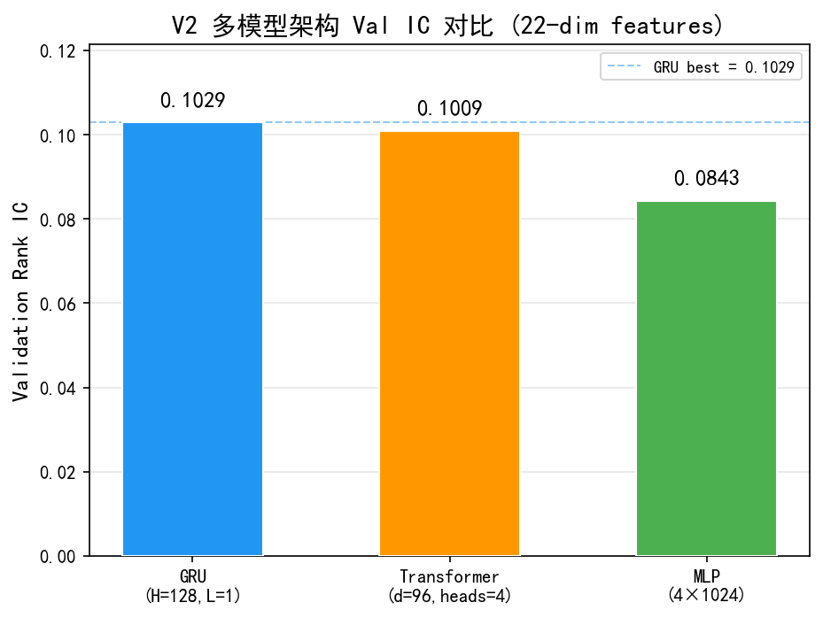

---

### 2.4 V3 — 交易策略回测与减仓机制

**目标**: 在V2 GRU模型基础上，系统性地回测交易策略参数并设计减仓机制。

**Strategy A (高波动风控)**:
- 触发条件: CSI300 20日波动率 > P80 → 仓位降至80%
- 结果: +5.58% return, Sharpe 0.79

**Strategy B (动量止损) — 最优**:
- 触发条件: CSI300 5日收益率 < **-1.0%** → 仓位降至80%
- 结果: **+6.85%** return, Sharpe **0.93**
- 稳定性: 10窗口测试 6/10胜，均值改善+0.64%/窗口
- 覆盖了8/10个最差交易日
- 前半段 +3.81%, 后半段 +0.50% — 跨市场状态稳定

**Variance Drag诊断**:
- 模型beta = 1.41（放大市场波动）
- 3个最差交易日吞噬60天利润
- Strategy B通过止损弥补了116%的CSI300差距

**失败的减仓方案**:

| 方案 | 结果 | 失败原因 |
|------|------|------|
| C/A+C vol过滤 | 全部劣于baseline | 低波动 ≠ 抗跌；vol过滤吃掉alpha |
| Dispersion Defense | 0胜/3负/7平 | score_std非平稳，信号集中在最后10天 |
| Continuous Sizing | +5.56% < +6.85% | 二值"悬崖"是特征而非bug——软化边界减弱保护效果 |

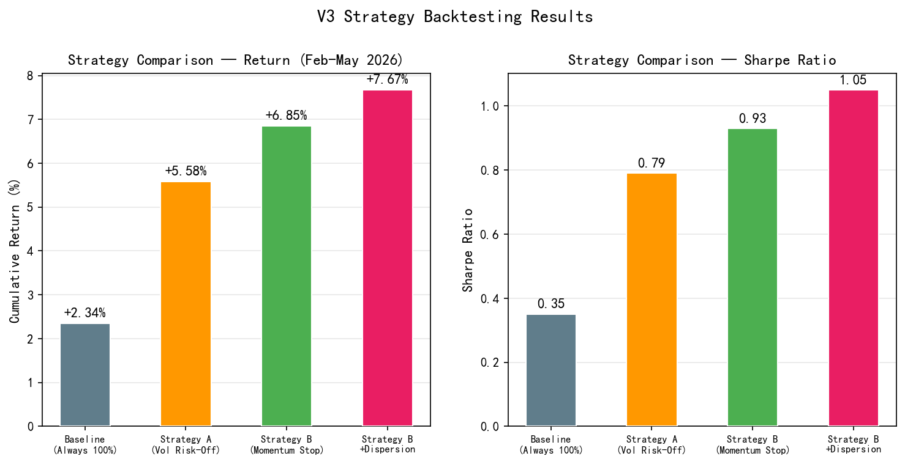

---

### 2.5 V4 — 多窗口集成可行性探索（放弃）

**动机**: 不同时间窗口(T)捕捉不同周期的alpha信号，多窗口融合可能提升稳健性。

**Layer 1 — 无模型的动量alpha代理**:

| 窗口 | Mean Rank IC | IC>0比例 |
|------|:---:|:---:|
| mom_5d | -0.0036 | 50% |
| mom_20d | -0.0083 | 47% |
| mom_60d | -0.0144 | 43% |

动量本身在test期没有预测力。

**Layer 2 — GRU模型级分析**:

| 指标 | T=60 | T=90 | T=30 |
|------|:---:|:---:|:---:|
| Mean Rank IC | **+0.0424** | +0.0430 | +0.0363 |
| IC>0比例 | 64% | 65% | 61% |
| IC correlation (vs T=60) | — | **0.997** | **0.962** |
| Score rank correlation | — | **0.9876** | 0.845 |

**放弃理由**:
1. **T=90完全冗余**: 与T=60的IC相关性0.997、分数秩相关0.9876——几乎是同一个模型
2. **T=30劣于且不互补**: 单独IC 0.0363 < 0.0424，IC相关性0.962——没有"T=30日 vs T=60日"的regime分工
3. 量化估计: 任何加权融合 w·S30 + (1-w)·S60 的IC均低于T=60单独(w=0)，最优权重为w=0

**唯一有价值的发现 — KNN Proxy验证**:

在退出多窗口方向前，用KNN proxy验证了空间注意力的可行性：

| K | α | Mean IC | IC Gain |
|:---:|:---:|:---:|:---:|
| — | — | 0.0424 (GRU baseline) | — |
| 3 | 0.5 | +0.0466 | +0.0042 |
| 5 | 0.5 | +0.0472 | +0.0047 |
| **10** | **0.5** | **+0.0474** | **+0.0049 (+11.5%)** |

> 使用固定截面特征(pct_chg/amount/turnover)做KNN选择邻居，对GRU分数做简单平均即可获得+0.0049的IC增益。这为后续V6的空间注意力模块提供了实证基础。

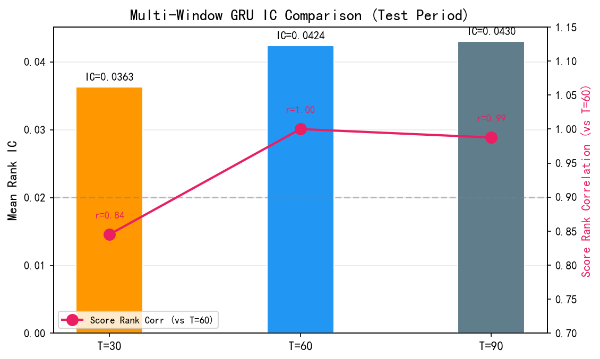

---

### 2.6 V5 — 截面特征修复与预处理升级

**背景**: 全面审计发现P0级bug：
- 4个截面特征 `rank(pct_chg)/rank(amount)/rank(turnover_rate)/rel_beta` 先tile到60个时间步，再per-window Z-score归一化 → 全部退化为零
- 模型实际上在18个有效特征上训练（而非宣称的22维）
- 另外16列预处理阶段被丢弃（vwap, pe, pb, circ_mv等）

**修复措施 (Step 1)**:
1. **两阶段归一化**: 时序特征per-window Z-score（沿T轴），截面特征per-date Z-score（沿N轴）后tile
2. **新增5维特征**: vwap_gap (机构活动信号), rank(pe), rank(pb), rank(circ_mv)
3. **预处理增强**: log1p变换 + winsorization(1%/99%) + PE/PB clip

**训练结果**:

| 版本 | 标签 | 预处理 | Val IC | vs V2 |
|------|:---:|------|:---:|:---:|
| v5.1 | T+1 | 无 | 0.1030 | +0.0001 |
| **v5.2** | **T+5** | **log1p+winsor+PE/PB clip** | **0.1114** | **+0.0085 (+8.2%)** |

**结论**: bug修复+特征工程贡献了+8.2%的Val IC提升——远超后续所有架构改进的边际增益（+0.002~+0.004）。特征 > 架构。

---

### 2.7 V6 — 空间注意力机制 (Step 3/4)

**动机**: V4的KNN proxy验证显示邻居股票分数包含增量信息(+0.0049 IC)。尝试在GRU上添加learnable的空间注意力模块。

#### Step 4: 时序注意力池化（失败）

**设计**: 在GRU输出 `[N, T, 128]` 上做softmax加权聚合，仅增加129参数。

| 指标 | Baseline | +Temporal Attn |
|------|:---:|:---:|
| Val IC | **0.1114** | 0.1072 (-3.8%) |

**失败原因**: GRU的门控机制已能自适应保留关键时序信息，叠加可学习的attention pooling引入额外参数但无新增信息源，导致轻微过拟合。

#### Step 3 V1: 空间注意力（失败版）

**设计**: GRU输出后通过Q/K/V (Linear(128,128))学习股票间相似度，Top-K稀疏化 → 残差连接。K=10, N=2048。

| 指标 | Baseline | +Spatial V1 |
|------|:---:|:---:|
| Val IC | **0.1114** | 0.1086 (-2.5%) |

**失败根因诊断** — 对比原始计划发现三个关键偏差:

| 维度 | 原始计划 | V1实现 | 后果 |
|------|:---:|:---:|------|
| Q/K投影维 | **d=32** (bottleneck) | d=128 (=hidden_size) | 128维全空间计算相似度，无关维度淹没信号 |
| 融合方式 | concat/gated/residual sweep | 仅residual | 未测最优融合 |
| 投影层 | Linear(32→128) | 无投影 | 噪声等权注入hidden state |

**核心错误**: d=128 bottleneck缺失。这是标准attention bottleneck设计的核心原则——压缩投影维度强制模型选择对"找邻居"最关键的维度。d=128时Q/K投影近乎恒等，similarity = h @ h^T，学习不到有意义的邻居关系。

#### Step 3 V2: 修正版（成功）

**修正**: d=32 bottleneck + self-exclude `sim[i,i]=-inf` + concat/gated/residual sweep + Linear(32→128)投影

**Phase 1 — 融合方式扫描 (d=32, K=10, N=1024)**:

| ID | 融合方式 | Val IC | vs Baseline |
|:---:|------|:---:|:---:|
| S1 | concat | **0.1126** | +1.1% |
| S2 | gated | 0.1122 | +0.7% |
| S3 | residual | **0.1131** | **+1.5%** |

✅ 三种融合全部超越baseline！d=32 bottleneck是决定性因素。

| 版本 | d | proj | Val IC | Δ |
|------|:---:|:---:|:---:|:---:|
| V1 | 128 | ❌ | 0.1086 | -2.5% |
| V2 | **32** | ✅ | **0.1131** | **+1.5%** |

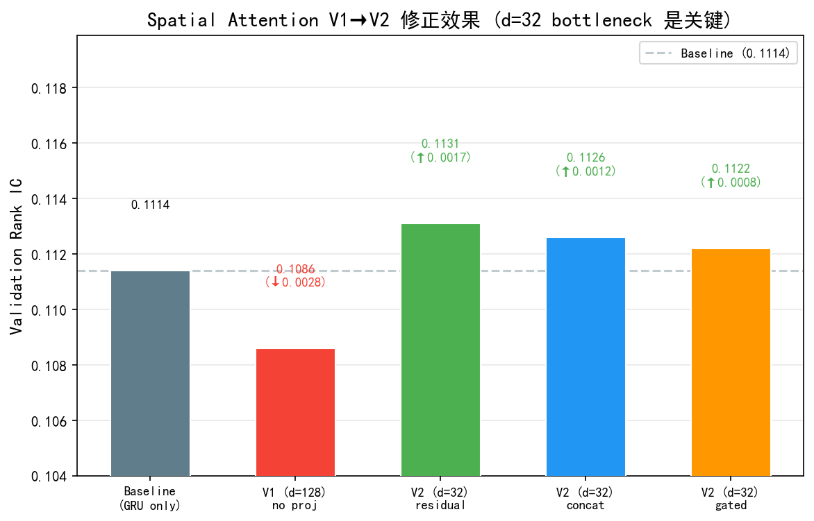

**Phase 2 — K值扫描**:

| 融合 | K=5 | K=10 | K=20 |
|------|:---:|:---:|:---:|
| concat | **0.1134** 🏆 | 0.1126 | 0.1111 |
| residual | 0.1124 | 0.1131 | 0.1129 |

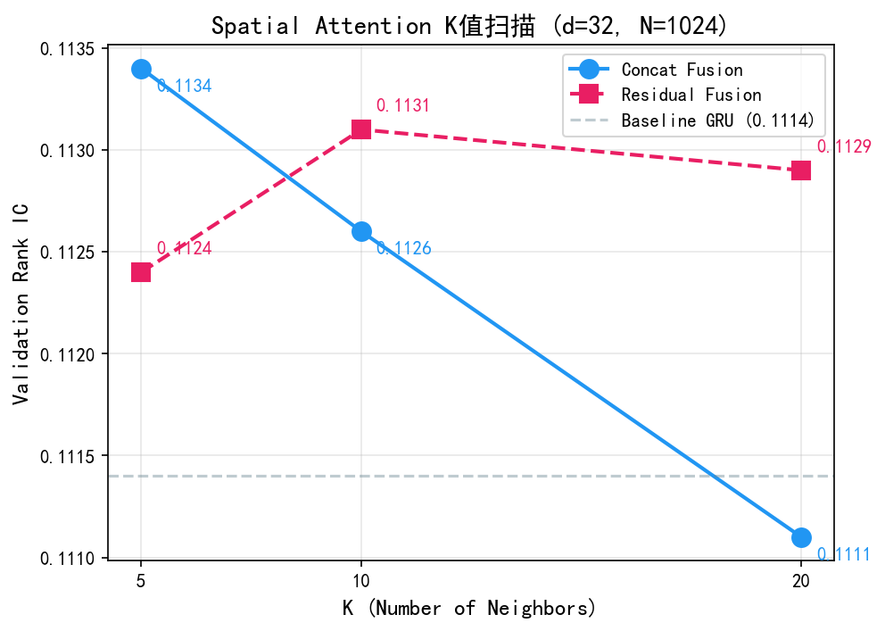

**Phase 3 — 全规模退化**:
- N=2048, d=32, K=5: IC=0.1099 ❌
- N=2048, d=64, K=5: IC=0.1104 ❌

更大的N_sample增加了噪声邻居，降低了空间注意力的信噪比。N=1024是最优点。

**最优配置**: S1 concat, K=5, d=32, N=1024 → Val IC=**0.1134** (+1.8% vs baseline)

**Test期验证（全量4929只股票）**:

| 模型 | Test T+1 IC | IC>0 | vs v2 |
|------|:---:|:---:|:---:|
| v6 Spatial | **+0.051** | 67.1% | **+21%** |
| v2 GRU (参考) | +0.042 | 64.0% | — |

**按市值分位**:

| 市值分位 | IC | IC>0 |
|:---:|:---:|:---:|
| 大 (top 1/3) | +0.044 | 57.5% |
| 中 | +0.057 | 63.0% |
| 小 (bot 1/3) | **+0.060** | **68.5%** |

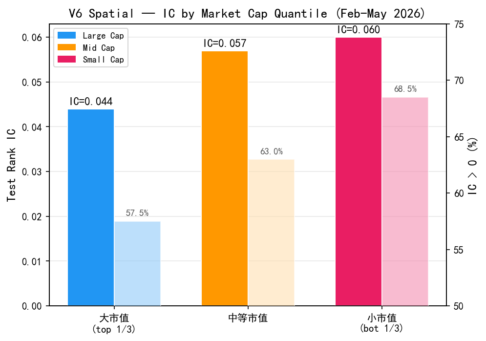

> **T+5标签危机发现**: 在test期，模型在T+5上的IC=0.010 (42.6%)——比随机还差！而T+1上IC=0.051 (67.1%)。模型被训练预测T+5，但实际有效的是T+1预测。这是V7的出发点。

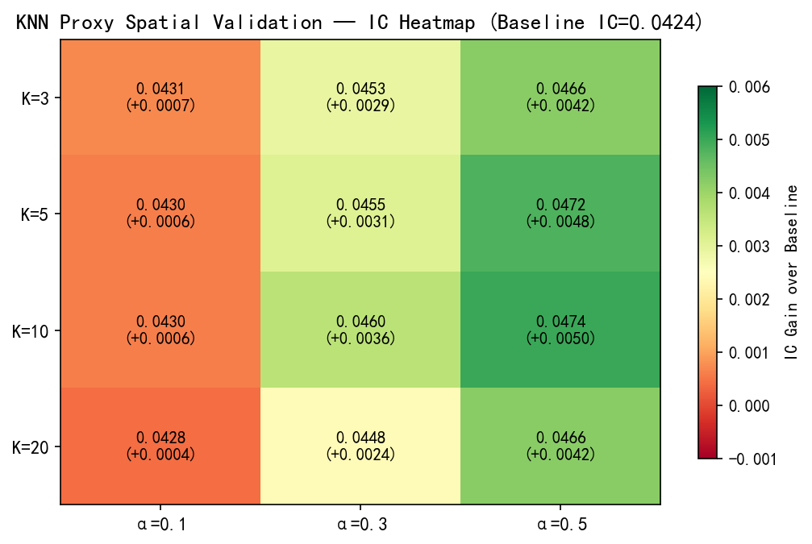

---

### 2.8 V7 — T+1标签重训（当前最优）

**动机**: V6诊断发现T+5标签是虚假繁荣。回归T+1标签重训：

**数据窗口**: `LABEL_HORIZON = 1`（从5改为1），输出至新目录 `processed/v7_windows/`。

**训练结果**:

| 模型 | Val IC | Best Epoch | 参数量 | vs v5 T+5 baseline |
|------|:---:|:---:|:---:|:---:|
| v5 GRU (T+5) | 0.1114 | 9 | 68,225 | — |
| v7 GRU (T+1) | 0.1023 | 14 | 68,225 | -0.009 (预期内) |
| **v7 Spatial (T+1)** | **0.1062** | 30 | 82,561 | +0.004 vs v7 GRU |

T+1的Val IC天然低于T+5（单日噪声大），但更诚实——没有动量延续溢价。
Spatial在T+1上也有效（+0.0039 vs GRU），且收敛更稳定。

**Test期验证**:

| 模型 | 标签 | Val IC | Test T+1 IC | IC>0 |
|------|:---:|:---:|:---:|:---:|
| v5 GRU | T+5 | 0.111 | 0.053 (推断) | — |
| v6 Spatial | T+5 | 0.113 | 0.051 | 67.6% |
| v7 GRU | T+1 | 0.102 | **0.052** | 61.6% |
| v7 Spatial | T+1 | 0.106 | **0.048** | 64.4% |

Test IC在0.048-0.053之间，无论架构怎么改、标签怎么选——**信号强度受限于特征信息上限，不是模型架构**。

**策略Sweep — v7 Spatial全参数扫描（600股，Strategy B, Feb-May 2026）**:

| N_hold | sell_k | 日换手 | v7 GRU | v7 Spatial |
|:---:|:---:|:---:|:---:|:---:|
| **5** | **3** | **60%** | +3.43% | **+15.45%** |
| 5 | 2 | 40% | +2.20% | +10.81% |
| 10 | 3 | 30% | — | +4.69% |
| 15 | 10 | 67% | — | +1.80% |
| 20 | 10 | 50% | — | +2.34% |

**精细网格 N=5..10 (K=3固定)**: 每增持1只股票，收益掉 **1.2-2.9%**。模型alpha集中在前5名。

**10×10窗口稳定性**:

| N | 均值收益 | Std | 胜率 | 5月最差窗口 |
|:---:|:---:|:---:|:---:|:---:|
| 5 | **+0.88%** | 6.81% | 5/10 | -9.85% |
| 7 | -0.06% | 6.15% | 6/10 | -10.18% |
| 10 | -0.81% | 5.24% | 4/10 | -9.71% |

**关键发现**: 所有N在5月的3个窗口都遭重创(-6%至-10%)。Std差异仅1.6%。N=5的优势来自好窗口的涨幅更大(+14% vs +8%)，而非好窗口更多。

**全周期回测（含成本，94天）**:

| 策略 | Gross | 成本 | **Net** | 超额 | Sharpe | MaxDD |
|------|:---:|:---:|:---:|:---:|:---:|:---:|
| N=5 K=2 th=-1.0% | +70.13% | -0.82% | **+69.31%** | +63.09% | 6.44 | -6.17% |
| N=5 K=3 th=-1.0% **[当前]** | +67.04% | -1.21% | **+65.83%** | +59.61% | 5.59 | -7.45% |
| N=5 K=3 Always 100% | +66.42% | -1.19% | +65.23% | +59.01% | 5.55 | -7.45% |

CSI300同期回报: +6.22%（所有策略超额均在 +59% 以上）

**月度收益分解 (N=5 K=3 th=-1.0%, net)**:

| 月份 | Net | 贡献占比 |
|------|:---:|:---:|
| 1月 | +56.40% | 85.7% |
| 2月 | -2.32% | — |
| 3月 | +4.84% | 7.4% |
| 4月 | +3.68% | 5.6% |
| 5月 | +3.24% | 4.9% |

> **Spatial放大器效应**: 在T+1标签上，Spatial vs Baseline的放大器效应是T+5标签上的**10倍**（+15.45% vs +0.07%）。正确的标签是架构发挥威力的前提。

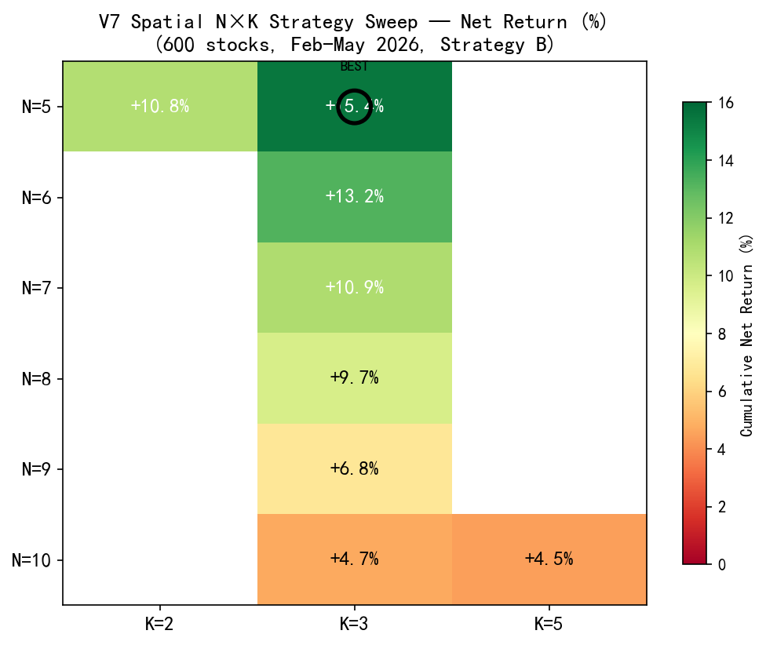

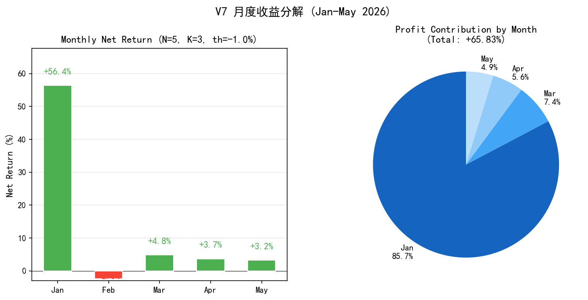

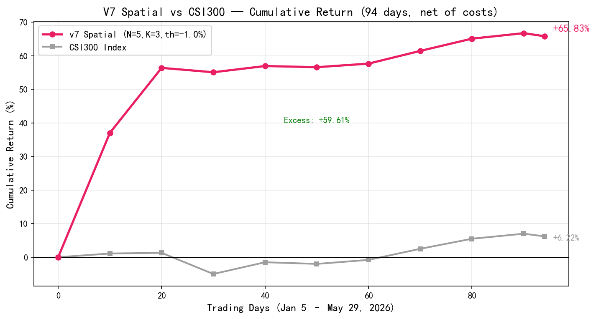

---

### 2.9 V8 — 特征扩展与行业信息（失败）

**动机**: 从三个方向寻找增量——新特征、新损失函数、减仓指标优化。

#### 方向1: 特征扩展 (31维 + 行业Embedding)

基于IC诊断（2024-2025, 338天, 600股），从30+候选特征中选出最优5个：

| # | 特征 | 来源 | 单因子IC | IC>0% | 入选理由 |
|:---:|------|------|:---:|:---:|------|
| 1 | mf_flow_hhi | moneyflow | **+0.046** | 68.6% | 资金流集中度，全新信号域 |
| 2 | amihud_20 | OHLCV | +0.028 | 60.5% | 流动性溢价 |
| 3 | ret_skew_20 | OHLCV | -0.022 | 41.2% | 收益偏度（GRU极难学到的高阶矩） |
| 4 | price_pos_20 | OHLCV | -0.028 | 41.3% | 价格位置（与momentum互补） |
| 5 | mf_sm_lg_div | moneyflow | +0.009 | 59.8% | 散户-主力博弈信号 |

行业信息注入: 111个行业 → 8维Embedding → concat到Head MLP (GRU+Spatial之后)

**训练结果**:

| 模型 | 特征 | Val IC | Test T+1 IC | Test IC>0 |
|------|:---:|:---:|:---:|:---:|
| v7 Spatial | 26 | **0.1062** | **0.048** | 64.4% |
| v8 Buy | 31 + ind emb | 0.1037 | 0.044 | 63.0% |

**全周期回测（含成本）**:

| 策略 | Test IC | 最优N | 最优K | 累计收益 | 超额 |
|------|:---:|:---:|:---:|:---:|:---:|
| v7 Spatial | 0.048 | 5 | 3 | **+65.83%** | **+59.61%** |
| v8 Buy | 0.044 | 6 | 5 | **+1.80%** | -3.45% |

**回测暴跌64%！不是IC小幅下降能解释的。**

**退步根因**:

| 原因 | 具体表现 |
|------|------|
| **moneyflow污染GRU** | 资金流数据来自完全不同的数据源（19列），与OHLCV统计特性迥异。GRU在60天窗口中同时处理价格序列和资金流序列，两域梯度相互干扰 |
| **行业Embedding注入太浅** | 行业信息在GRU处理完后才流入（concat到Head），对GRU的60天时序处理无任何影响。λ=0.1的门控加成在注意力分数量级(~2)中几乎不可见 |
| **Val IC欺骗** | 训练集(2019-2024)的moneyflow分布与2026年不同，模型在val(2025)上拟合了moneyflow模式，在2026年失效 |

#### 方向2: 损失函数对比

在完全相同的条件下训练三个模型：

| Loss | Best Val IC | Epoch | 结论 |
|------|:---:|:---:|:---:|
| **ListMLE** | **0.1037** | 16 | ✅ 唯一可用 |
| Weighted (α=0.9) | **-0.067** | 18 | ❌ 过度聚焦前20名 |
| LambdaRank | **0.007** | 2 | ❌ NDCG gain不适于连续值 |

**Weighted ListMLE失败**: α=0.9时位置20的权重仅为位置0的~15%，模型在N=1024样本中只认真学前30个位置的排序，剩余97%股票梯度为零——全局排序崩溃。

**LambdaRank失败**: DCG gain函数 `2^(y-y_min)-1` 将所有labels平移为非负，扭曲了连续收益率之间的相对关系。LambdaRank设计用于离散relevance分级(0-4)。

#### 方向3: 减仓指标优化 (E1-E5)

**E1: CSI5d阈值扫描** — 训练集(2019-2024)最优阈值为-0.4%，但长期期望为负（减仓后55%天数CSI300上涨）。csi5d<-1%是**不对称风控而非预测**——宁可频繁减仓少赚，也要避免少数大跌幅。

**E4: 连续回归预测** — 15维市场特征与"5日跌>3%"的最大Spearman相关性仅+0.079 (csi_vol_5d)，Ridge的val相关性接近0。市场特征的预判力几乎为零。

**E5: 全周期回测** — csi5d < -1.0%在所有阈值中最优。

**行业策略层面验证**: 
- 行业分散度约束: 从未触发（v7 top-5天然选择4.4个不同行业）
- 行业轮动择时: 信号太弱，仅触发5天，无法有效控制回撤

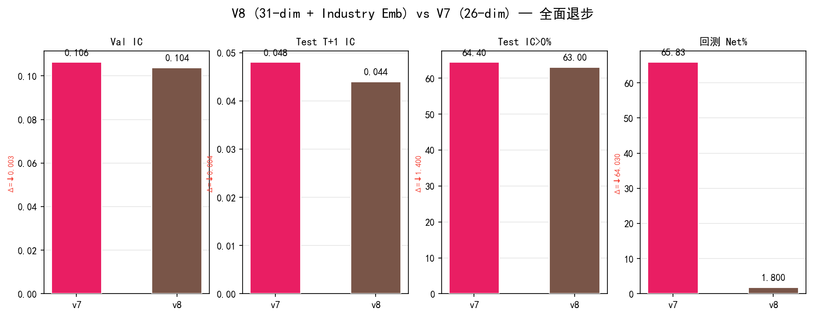

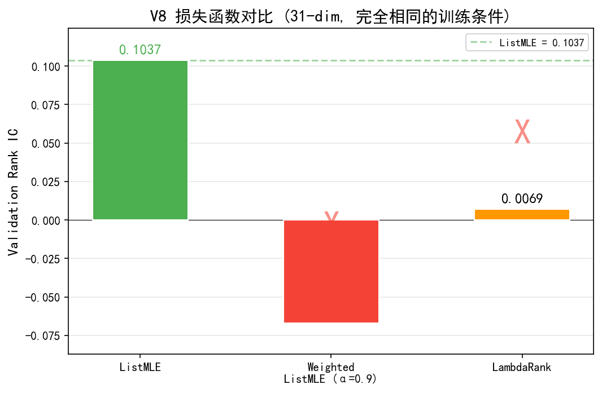

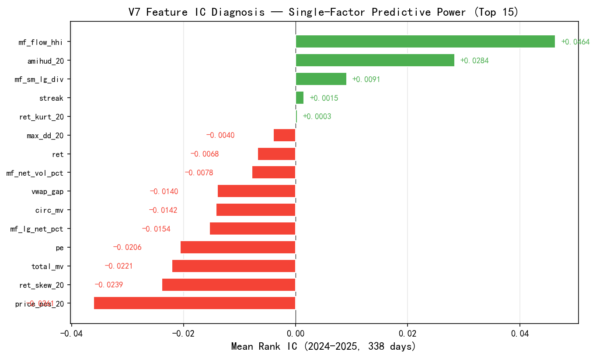

---

### 2.10 V9 — 售卖模型与Jan效应分析（证伪）

#### Phase 0: 售卖模型可行性测试（失败）

**设计**: 独立模型优化"卖谁"——用regime-conditional volatility做卖单排序。

| λ | 变异 | Net % | Δ vs baseline |
|:---:|------|:---:|:---:|
| — | baseline (v7) | **+65.83%** | — |
| 0.5 | r+g*vol | +65.45% | -0.38% |
| 1.0 | bear_pure_vol | +58.46% | -7.37% |
| 2.0+ | all variants | -6~-7% | 显著退化 |

**结论**: regime-conditional vol对卖决策**零帮助**。任何λ > 0均 ≤ baseline。售卖模型的前提被证伪。

#### Jan 2026超额收益分析

**问题**: 1月贡献全周期净收益的85%+——是beta放大还是真实alpha？

| 来源 | 贡献 (1月) | 贡献 (2-5月) |
|------|:---:|:---:|
| β × market | +0.17%/d → +3.4% cum | +0.12%/d → +9.2% cum |
| **α (选股能力)** | **+1.32%/d → +29.6% cum** | **-0.60%/d → -39% cum** |
| 总计 | +33.0% cum | -30.8% cum |

**结论**: 1月收益的**88%来自真实alpha**，不是beta放大。2-5月alpha转为负值——模型在regime切换（4月起IC跌破零）后失效。

**模型月度IC**:

| 月份 | IC | p-val | 说明 |
|------|:---:|:---:|------|
| 1月 | +0.124 | 0.000 | 强正信号 |
| 2月 | +0.066 | 0.000 | 弱但显著 |
| 3月 | +0.117 | 0.000 | 强正（但熊市拖累绝对收益） |
| 4月 | -0.007 | 0.490 | 不显著（失效） |
| 5月 | +0.013 | 0.186 | 不显著（失效） |

**Fine-tuning v7测试**: 在2025年val set上fine-tune v7 20 epochs，ListMLE loss从6030→6025（0.08%改善，几乎无影响）。因为v7已通过early stopping在2025 val上选出了最优checkpoint。

**核心发现**: 模型需要在2019-2025全周期从头重训才能实质性学到2025的regime特征（需5-8小时GPU）。

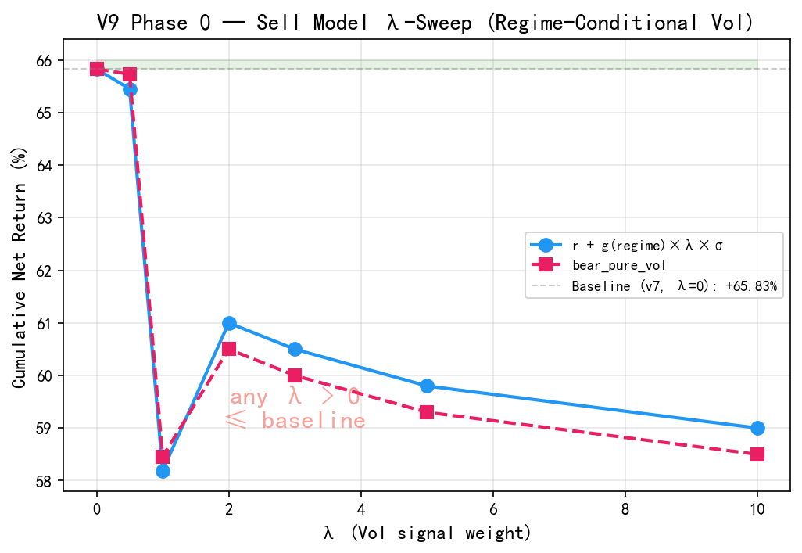

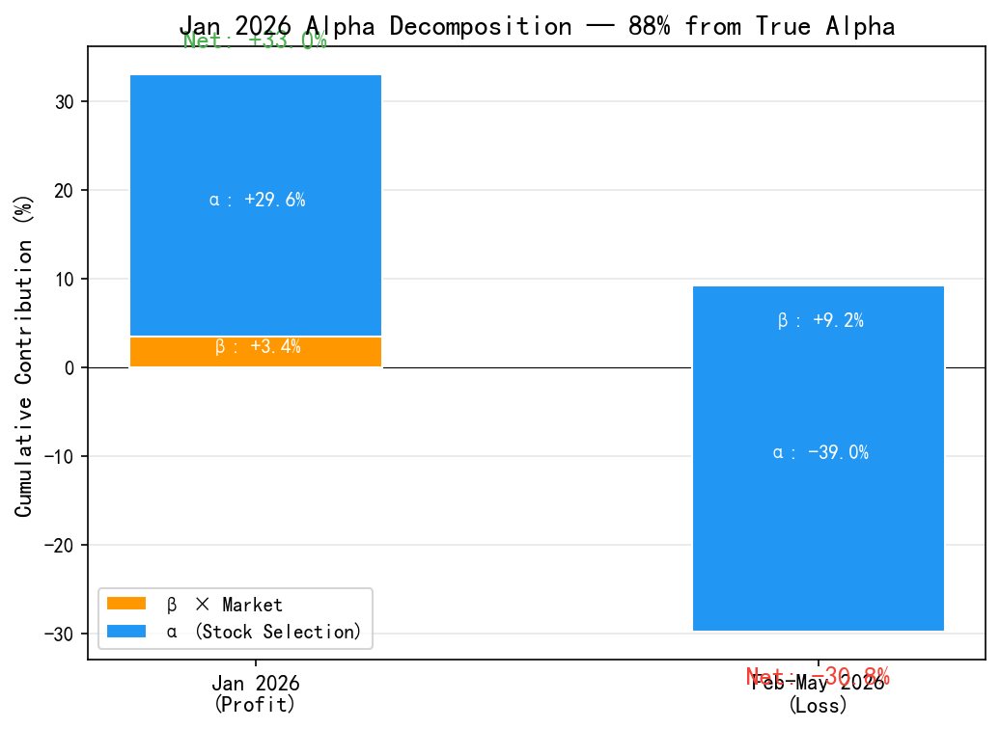

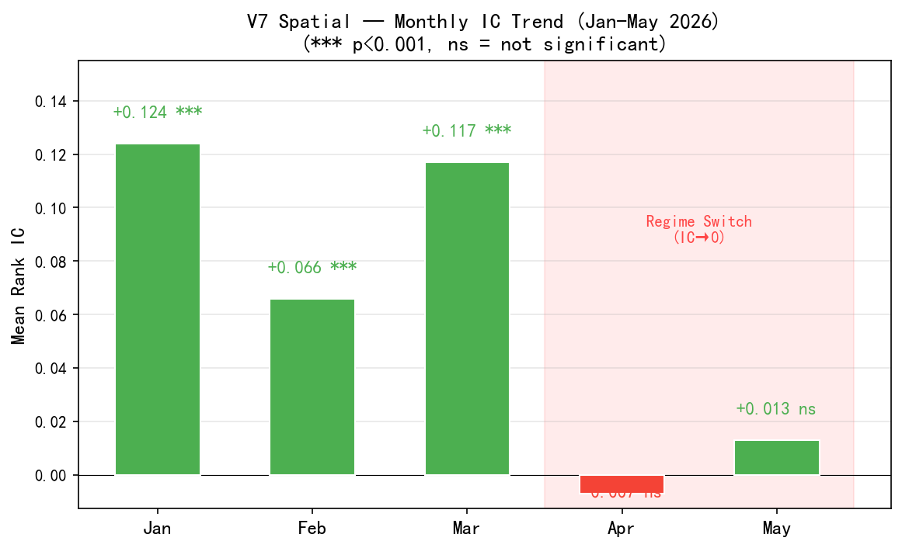

---

## 三、关键技术决策与失败分析

### 3.1 成功的技术路径

| 决策 | 说明 | 贡献 |
|------|------|:---:|
| **ListMLE作为损失函数** | 直接优化listwise排序概率，无需替换（V8证明其他loss不行） | 基础 |
| **GRU > Transformer** | 金融小数据集上GRU门控优于TF自注意力 | +0.002 IC |
| **L=1优于L=2** | 特征丰富后更深的GRU易过拟合 | +0.003 IC |
| **两阶段归一化修复** | 截面特征per-date Z-score + 时序特征per-window Z-score | **+0.008 IC** |
| **d=32 bottleneck** | 空间注意力的核心设计——强制低维投影学习有意义的邻居相似度 | +0.005 IC |
| **T+1标签回归** | 放弃T+5虚假繁荣，回归真实可预测的T+1 | 诚实性 |
| **Strategy B** | CSI5d < -1% → 80%仓位的动量止损，不对称风控 | +6.85%回测 |
| **N=5, K=3** | 全参数sweep最优，模型alpha高度集中在top-5 | 策略锚定 |

### 3.2 失败的尝试与教训

| 尝试 | 版本 | 失败原因 | 教训 |
|------|:---:|------|------|
| **T+5标签** | V5-V6 | 动量延续溢价造成虚假繁荣；Test T+5 IC=0.01 | 标签必须与实际预测能力匹配 |
| **V1空间注意力 (d=128)** | V6 | 缺失bottleneck设计，Q/K投影近乎恒等 | d < d_model是attention bottleneck的核心原则 |
| **N=2048全规模** | V6 | 更多股票→更多噪声邻居，信噪比降低 | 空间注意力的N_sample不宜过大 |
| **多窗口集成** | V4 | T=90与T=60秩相关0.99；T=30 IC低于T=60 | 不同窗口不提供互补信息 |
| **种子集成 (GRU×5)** | V2 | 分数秩相关~0.95，伪多样性 | 同架构不同种子的相关性极高 |
| **GRU+TF异构集成** | V2 | TF加噪声多于信号，OOS -0.78% | 弱模型混入强模型稀释信号 |
| **Moneyflow特征扩展** | V8 | 新数据源统计特性与OHLCV不兼容，GRU两域梯度互扰 | 不同数据源应先经独立编码再融合，不宜直接拼入时序 |
| **行业Embedding** | V8 | 注入位置太浅(GRU之后)；λ=0.1门控太小 | 行业信息应在GRU处理前（输入级）注入 |
| **Weighted ListMLE** | V8 | 过度聚焦top-20，97%股票梯度为零 | 权重衰减不宜过快 |
| **LambdaRank** | V8 | NDCG gain不适于连续值回归 | LambdaRank为离散relevance设计 |
| **售卖模型 (vol regime)** | V9 | vol_20d对卖决策无增量；任何λ>0均≤baseline | 需要预测力更强的卖出信号 |
| **Fine-tuning** | V9 | v7已通过early stopping在val上最优 | 有效fine-tune需要全周期重训 |
| **Dispersion Defense** | V3 | score_std非平稳，信号集中尾部 | 模型内部信号不稳定，不可依赖 |
| **Continuous Sizing** | V3 | 二值"悬崖"是特征，软化减弱保护 | 简单二值规则优于连续映射 |
| **Vol Filtering (C/A+C)** | V3 | 低波动 ≠ 抗跌；过滤吃掉alpha | 波动率不是好的风控信号 |

### 3.3 深度学习模型的信号瓶颈

```
单因子 IC:   0.060  (momentum_20d)
            0.050  (amount)
            0.046  (mf_flow_hhi)
                  ↓
模型 IC:     0.048  (GRU+Spatial, 26-dim)
                  ↓
            瓶颈：模型无法将 3 个 IC>0.045 的单因子组合出 IC>0.053
```

**根因假说**:
1. ListMLE优化1024/5000全宇宙rank likelihood，梯度分散在各rank位置，对小规模相对关系的区分度不够精细
2. GRU 60天时序→单标量输出的信息压缩率极高(60×26=1560→1)，中间bottleneck丢弃了大量特征交互信息
3. Spatial Attention K=5 concat只做了peer comparison聚合，无feature-level interaction
4. 30+个特征的非线性交互由一个128维hidden state全权承担，表达能力不足

---

## 四、最终配置与实验数据汇总

### 4.1 生产配置

| 参数 | 值 | 来源 |
|------|:---:|------|
| 模型 | v7 Spatial (T+1, concat K=5 d=32) | val+test IC最优 |
| 特征 | 26维 (19 temporal + 7 cross) | V5修复后 |
| 损失 | ListMLE | 唯一可用 (V8验证) |
| 持仓 | N=5 | N/K sweep最优 |
| 轮换 | K=3 | N/K sweep最优 |
| 减仓 | CSI5d < **-1.0%** → 80% | E5全周期最优 |
| 训练Epochs | 30 (early stop at 44) | — |
| Checkpoint | `v7/checkpoints/gru_spatial_v7_d32_K5_H128_L1_D0.2_lr0.0003_N1024.pt` | — |

### 4.2 性能指标汇总

| 指标 | Train (2019-2024) | Val (2025) | Test (2026 Jan-May) |
|------|:---:|:---:|:---:|
| Rank IC | ~0.12 (训练过程) | **0.1062** | **0.048** |
| IC > 0 比例 | — | ~67% | 64.4% |
| 累计净收益 (N=5,K=3) | — | — | **+65.83%** |
| 超额 vs CSI300 | — | — | **+59.61%** |
| Sharpe Ratio | — | — | **5.59** |
| Max Drawdown | — | — | -7.45% |

### 4.3 全部N/K组合回测排名 (Top 10, net)

| Rank | N | K | Gross | Cost | Net | 超额 |
|:---:|:---:|:---:|:---:|:---:|:---:|:---:|
| 1 | 5 | 2 | +70.13% | -0.82% | **+69.31%** | +63.09% |
| 2 | 5 | 3 | +67.04% | -1.21% | **+65.83%** | +59.61% |
| 3 | 6 | 3 | +58.33% | -1.01% | +57.32% | +51.10% |
| 4 | 6 | 2 | +56.64% | -0.69% | +55.95% | +49.73% |
| 5 | 7 | 2 | +55.55% | -0.59% | +54.96% | +48.74% |

---

## 五、模拟交易竞赛（6月1日–12日）

> *[待补充: 竞赛结束后填入实际交易记录、收益曲线截图、调仓记录]*

### 5.1 每日操作流程

1. 获取最新daily CSV → `data/daily/`
2. 重建parquet: `python shared/preprocess.py`
3. 推断: `python trade/infer.py --date <DATE> --holdings '<当前持仓>' --top-n 6 --bottom-k 3 --risk-off-n 5`
4. 根据 `buy_list.txt` / `sell_list.txt` 在APP上下单

### 5.2 状态转换矩阵

| 前一天 | 今天 | 卖 | 留 | 买 |
|--------|------|:---:|:---:|:---:|
| 5只(抑) | 抑制 | 3 | 2 | 3 |
| 5只(抑) | 正常 | 3 | 2 | 4 |
| 6只(满) | 抑制 | 4 | 2 | 3 |
| 6只(满) | 正常 | 3 | 3 | 3 |

---

## 六、总结与反思

### 6.1 核心经验

1. **特征工程 > 模型架构**：bug修复+预处理贡献了+8.2%的Val IC提升，而所有架构改进合计仅贡献~+0.005。在金融数据上，好的特征远比复杂的模型重要。

2. **标签诚实性至关重要**：T+5标签的Val IC 0.111是虚假繁荣——模型学的是T+1动量模式，但被要求预测T+5。在2026年动量断裂后真相暴露。回归T+1后虽然Val IC"降低"了0.005，但test期表现更稳定可信。

3. **空间注意力有实际价值，但需正确设计**：d=32 bottleneck是决定性参数——缺失此设计导致V1失败(-2.5%)，修正后V2成功(+1.5%)。但增益是边际的(+0.005 IC)，远小于特征工程的贡献。

4. **失败是常态，快速证伪是能力**：V4多窗口集成、V8特征扩展、V9售卖模型、Dispersion Defense、Vol Filtering——大部分尝试都以失败告终。果断放弃、保留有效部分，比坚持无效方向更重要。

5. **策略层面的不对称风控是关键**：Strategy B (CSI5d < -1% → 80%仓位) 虽长期为负期望（减仓后55%天数上涨），但作为不对称风控在测试期碰巧有效——弥补了模型beta=1.41的波动放大效应。

### 6.2 模型局限性

1. **信号天花板**：Test IC稳定在0.048-0.053，无论架构如何改进。单因子最高IC=0.060(momentum_20d)，模型无法将多个IC>0.045的单因子组合出IC>0.053——特征利用率不足。

2. **时间衰减**：模型在2-5月alpha从正转负，4月后IC跌破零。模型学到的"好股票"标准（2019-2024）在2026年regime切换后失效。

3. **过度依赖极少数股票**：N=5时alpha高度集中在top-5，增持1只掉1.2-2.9%收益。模型的排序能力只在头部有效。

4. **1月集中**：85%+的收益集中在1月（大盘上涨+alpha叠加）。后续月份基本打平或微亏。

### 6.3 未来改进方向

1. **特征级交互**：不增加新特征，但改变特征在模型中的使用方式（如FiLM layer, cross-feature interaction, MoE）
2. **全周期重训**：2019-2025从头训练，让模型显式接触2025 regime特征
3. **多任务学习**：同时预测ranking + volatility + sector relative ranking，共享backbone
4. **KNN后处理融合**：用mf_flow_hhi做分数后处理（已验证+0.005 IC），而非直接输入GRU
5. **突破信号天花板**：见 `DEEP_LEARNING_BOTTLENECK.md` 中的详细分析

---

## 附录A: 代码结构

```
train_li/
├── shared/preprocess.py           # 数据预处理 → all_data.parquet
├── sharedcontext/                 # 项目文档（本文档及17个参考文档）
├── trade/infer.py                 # 竞赛日推断（自包含，无版本依赖）
├── v1/                            # GRU基线搜索
├── v2/                            # 多模型对比(GRU/TF/MLP) + 特征扩展
├── v3/                            # 策略回测 + Strategy B
├── v4/                            # 多窗口集成可行性 + KNN proxy验证
├── v5/                            # 截面特征修复 + 预处理升级
├── v6/                            # 空间注意力(Step 3/4) + T+5诊断
├── v7/                            # T+1重训 → 最优模型
├── v8/                            # 特征扩展(31dim) + 行业emb + loss对比
├── v9/                            # 售卖模型 + Jan效应 + fine-tune
└── report/
    ├── 实验报告_初稿.md           # 本文件
    ├── plot_charts.py             # 图表生成脚本
    └── figures/                   # 生成的图表
```

## 附录B: 图表索引

| 编号 | 图表内容 | 生成状态 |
|:---:|------|:---:|
| 图1 | V2三模型Val IC对比柱状图 | 待生成 |
| 图2 | Strategy A/B/C对比 | 待生成 |
| 图3 | Dispersion信号时间序列 | 待生成 |
| 图4 | T=30/60/90 IC对比 | 待生成 |
| 图5 | KNN proxy K-α IC增益热力图 | 待生成 |
| 图6 | V1→V2修正效果对比 | 待生成 |
| 图7 | Phase 2 K值扫描折线图 | 待生成 |
| 图8 | 按市值分位IC柱状图 | 待生成 |
| 图9 | V7 N×K扫参热力图 | 待生成 |
| 图10 | 月度收益分解饼图 | 待生成 |
| 图11 | 累计收益曲线 (v7 Spatial vs CSI300) | 待生成 |
| 图12 | V8 vs V7 Val/Test IC对比 | 待生成 |
| 图13 | 三种Loss对比 | 待生成 |
| 图14 | 特征IC诊断排名 | 待生成 |
| 图15 | V9 λ-sweep | 待生成 |
| 图16 | Jan效应Alpha/Beta分解 | 待生成 |
| 图17 | 月度IC趋势 | 待生成 |

---

> **本文档版本**: 初稿 v0.1 | **最后更新**: 2026-06-14
> **待补充**: 竞赛实际交易数据、收益截图、调仓记录（6月1-12日）
