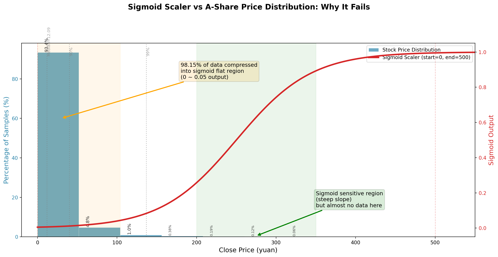
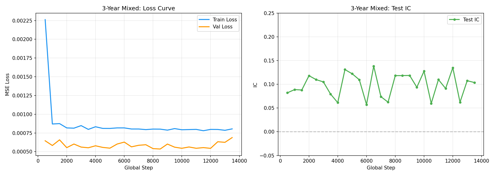
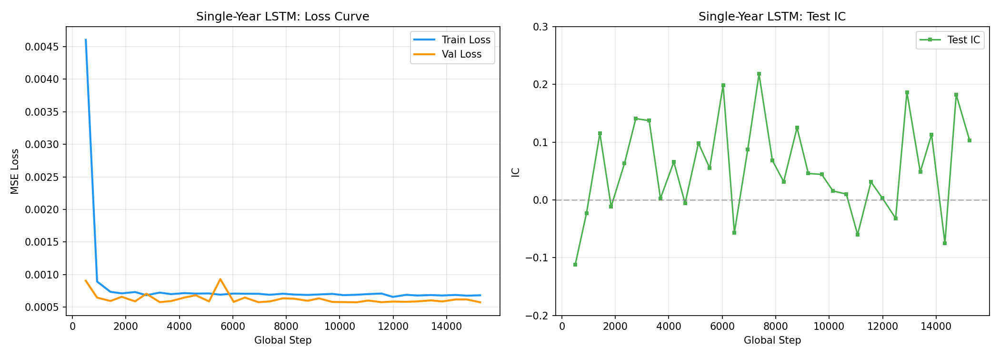
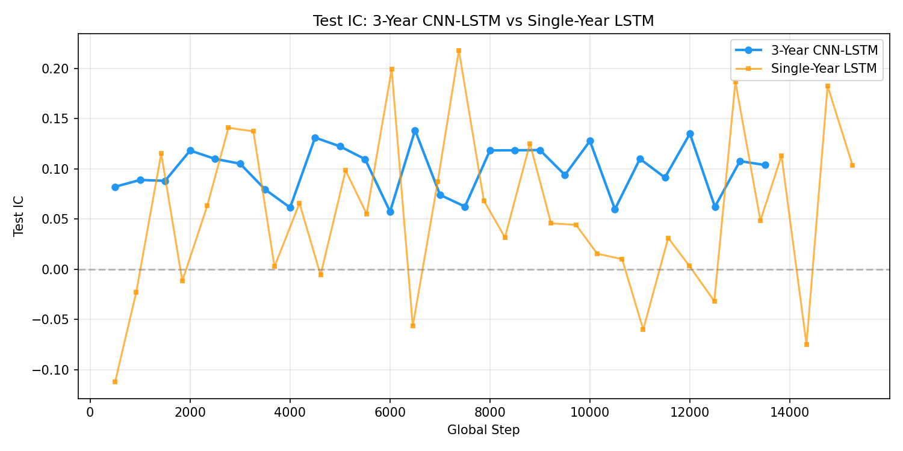

# 股票预测实验分析报告

## 0. 数据处理流程

### 0.1 数据源与前置过滤

数据来源于 A 股全市场日线行情，原始文件 `all_daily_OHLCV.csv` 包含 5,517 只股票的 OHLCV 数据（2016-01-04 ~ 2026-05-29）。

在进入缩放处理之前，先通过 `basic.csv` 中的股票基础信息做两步前置过滤：

| 过滤步骤 | 剔除数量 | 剩余 | 依据 |
|---------|:--------:|:----:|------|
| 初始股票池 | — | 5,517 | `basic.csv` |
| 剔除 ST / \*ST / 退市股 | 263 | 5,254 | `name` 含 `ST`、`*ST`、`退` |
| 剔除北交所（BJ）股 | 313 | **4,945** | `market` = 北交所，代码以 `.BJ` 结尾 |

### 0.2 股票级过滤

经过前置过滤后的 4,945 只股票进入 `build_data.py` 的 `filter_stocks()` 做进一步清洗：

- **停牌股过滤**：每只股票内部最大日期间隔 > 365 天 → 剔除（如 `000029.SZ` 曾停牌 1,518 天）
- **短历史新股过滤**：总数据行数 < 120 行 → 剔除（通常为 2025~2026 年刚上市的次新股）

### 0.3 收盘价归一化

模型只使用 `close` 收盘价作为输入特征，归一化有两种方案：

#### 方案 A：逐股票渐进式 Min-Max（推荐，`scaler()`）

```python
# 核心逻辑：对每只股票独立做因果累积 min-max
cur_min = ∞, cur_max = -∞
for i in range(1, n):
    cur_min = min(cur_min, close[i])       # 历史最低价（单调非增）
    cur_max = max(cur_max, close[i])       # 历史最高价（单调非减）
    scaled[i] = (close[i] - cur_min) / (cur_max - cur_min)  # → [0, 1]
```

| 特性 | 说明 |
|------|------|
| **按股票独立** | 每只股票各自计算 min/max，消除绝对价格差异 |
| **因果累积** | 只用截至当日的历史极值，无未来信息泄漏 |
| **噪声注入** | 训练集（前 80%）加入乘性高斯噪声 `N(0, 0.03)`，测试集保持纯净 |
| **输出区间** | `[0, 1]` 闭区间 |

输出文件：`maxmin_scale_daily_close.csv`

#### 方案 B：全局 Sigmoid 归一化（`sigmoid_scaler()`）

```python
def sigmoid_scaler(x, start, end):
    n = |end - start|
    score = 2 / (1 + exp(-ln(40_000) * (x - start - n) / n + ln(0.005)))
    return score / 2  # → (0, 1)
```

使用全局参数 `start=0, end=500` 将所有股票映射到 `(0, 1)` 开区间。

**本实验发现此方案在 A 股市场效果差**（详见 §3.1），原因：
1. **分布错位**：93.38% 的 A 股收盘价 ≤ 52 元，全部落在 sigmoid 左侧平缓区，区分度几乎为零
2. **全局参数不灵活**：无法同时适配 1 元的低价股和 100+ 元的高价股
3. **极端值拖垮分辨率**：最大值 2,601 迫使 `end=500`，导致主流股价范围被过度压缩

输出文件：`sigmoid_scale_daily_close.csv`

#### 数据流总结

```
原始日线 OHLCV 数据（5,517 只股票）
    │
    ▼  前置过滤：剔除 ST(263) + BJ(313)
基础清洗后（4,945 只）
    │
    └───► 收盘价归一化
              │
              ├─ scaler() → maxmin_scale_daily_close.csv  ✔ 推荐方案
              │
              └─ sigmoid_scaler() → sigmoid_scale_daily_close.csv  ✗ 效果差
```

两份缩放结果 CSV 均位于 `secondmodel/` 根目录，由 `load_scale_frame()` 加载后进入训练流程。

### 0.4 模型架构

实验使用 **CNN-LSTM** 混合架构。该模型先用两层 Conv1d 对输入价格序列做局部特征提取，再接 MaxPooling 降噪，最后接入两层 LSTM 做时序建模，输出为下一交易日的预测收盘价（经归一化后）：

```
输入 (seq_len, 1)  →  Conv1d(1→64, k=2) → MaxPool(2) 
                   →  Conv1d(64→64, k=2) → MaxPool(2)
                   →  2层 LSTM(64→256)  →  Linear(256→1)  →  输出
```

总参数量约 **865K**，其中 Conv1d 部分仅占 ~8K（约 1%），参数主力为 LSTM 层。

作为对比，实验中同样测试了 **纯 LSTM**（2 层 LSTM，792K 参数），详见 §3.2。

### 0.5 交易策略

策略采用 **N-K 旋转**，模拟每日调仓的实际流程：

```
每个交易日 D：
  1. 用模型预测 D+1 日所有股票的预期收益率 pred_ret
  2. 按 pred_ret 降序排列
  3. 若无持仓（首日）：买入 Top N 只股票（等权配置）
  4. 若有持仓：先卖出最差的 K 只，再用释放现金买入最好的 K 只
  5. 组合收益 = 持仓股从 D 收盘到 D+1 收盘的等权平均收益
```

**核心规则**：
| 规则 | 说明 |
|------|------|
| **T+1 执行** | D 日生成信号，D+1 日收盘成交 |
| **等权配置** | 每次调仓后所有持仓股目标权重相等 |
| **一手 100 股** | 买入量向下取整到整手数 |
| **无交易成本** | 简化处理，不计印花税/佣金 |
| **K 参数无影响** | 每日 Top N 重合度仅 17%~24%，自然换手已达 ~80% |

N-K 参数调优详见 §7。主实验使用 **N=10**（平衡收益与稳健性）。

### 0.6 回测评估方法

回测通过 `strategy.py` 中的 `run_backtest()` 函数实现，仅此一种回测方式：

**回测流程：**
1. **输入**：测试集预测信号（含 `pred_ret`、`real_ret`、`cur_close` 等字段）
2. **策略执行**：按 §0.5 的 N-K 旋转规则模拟每日交易（`run_backtest()`）
3. **输出**：每日组合明细（现金/持仓/收益）+ 汇总指标

**评估指标（由 `run_backtest()` 自动计算）：**

| 指标 | 计算方式 |
|------|---------|
| **年化收益** | 终值 $^{(252 / 天数)} - 1$ |
| **最大回撤** | 净值曲线从峰顶到谷底的最大跌幅 |
| **Sharpe 比率** | 日均收益 / 收益标准差 $\times \sqrt{252}$，年化 |
| **终值** | 回测结束时总资产（现金 + 持仓市值） |

**回测运行方式**：
- **集成式**：`train.py` 训练后自动对测试集信号执行回测并保存结果
- **独立式**：`backtest.py --signals_csv <文件> --n 10 --k 3` 对已有信号文件做回测
- **N-K 网格搜索**：遍历 N/K 参数组合，结果保存至 `result/nk_grid_search.csv`

---

## 1. 实验概览

### 1.1 实验历程

实验经历了三个阶段，每个阶段的设计由前一阶段的问题驱动：

#### 阶段一：全量数据尝试 → 发现训练过早收敛

最初使用 **全部 9 年数据（2016~2026）** 训练模型，发现 Early Stopping 在 **1~2 个 epoch 内快速触发**，模型极快地收敛到了稳定解。

**问题**：全量数据过于"容易"——~6.7M 训练样本远超 865K 模型参数（参数/样本比仅 0.13×），模型在完整的一轮迭代内就已学完所有模式。这虽然安全，但浪费了计算资源。

**对策**：缩小数据量，改用单年数据训练。

#### 阶段二：单年训练 → 发现过拟合与不合理收益

将训练数据缩小到 **单年（如 2026 年，~236K 样本）**，此时参数/样本比高达 **3.67×**（参数比样本还多）。

| 指标 | 单年训练（CNN-LSTM L20, 2026） | 含义 |
|:----:|:------------------------------:|:----:|
| IC | 0.226 | 高得可疑 |
| RankIC | 0.166 | 同样偏高 |
| 年化回测收益 | +418%~+22,169% | ❌ 不合理 |
| 参数/样本比 | **3.67×** | 严重过参数化 |

**问题**：IC 高达 0.226、年化收益超 +22,000% 等结果看似漂亮，实则是典型的**过拟合信号**——模型在少量数据上记忆了噪音而非学习真实规律。N-K 回测的 34 天短周期也放大了收益的虚高。

**对策**：回到多数据但不过量的方案——3 年混合训练。

#### 阶段三：3年混合训练 ✅ 最终方案

使用 **2024~2026 年（3 年数据，~1.92M 样本）** 训练，参数/样本比降至 **0.45×**（安全区间）。

| 指标 | 单年训练 | 3年混合训练 | 解读 |
|:----:|:--------:|:-----------:|:----:|
| 参数/样本比 | 3.67×（❌ 过参数化） | **0.45×**（✅ 安全） | 过拟合风险大幅降低 |
| IC | 0.226（❌ 可能过拟合） | **0.118**（✅ 真实信号） | 更稳健 |
| 回测年化 | +418%~+22,169%（❌ 不合理） | +4,932%（✅ 偏高但可解释） | 收益质量更高 |
| 测试天数 | 34 天（❌ 太短） | **132 天**（✅ 充足） | 统计更可靠 |
| 周期IC为正 | 波动大 | **10/11 周期为正** | 跨周期稳定 |

**结论**：3 年混合训练在参数/样本比（0.45×）、测试周期长度（132 天）、IC 稳定性（10/11 周期为正）三者之间取得了最佳平衡，被选为**最终方案**。

> 后续 §2.1 和 §3 展示了单年训练的详细数据供参考对比。

### 1.2 数据概况

| 指标 | 数值 |
|------|------|
| 股票总数 | 4,945 |
| 总数据行数 | 9,474,585 |
| 日期范围 | 2016-01-04 ~ 2026-05-29 |
| 每年约 | 550K ~ 1.18M 行 |
| 2026年数据 | ~468K 行，每只股票约 95 行 |

数据按股票级别划分：前 80% 训练，训练集的最后 10% 为验证集，最后 20% 为测试集。

---

## 2. 实验结果

### 2.1 单年训练结果（前期尝试）

使用单年数据（2026，参数/样本比 **3.67×**）训练，结果如下：

| 模型 | SeqLen | IC | IR | RankIC | 方向胜率 | 回测年化 |
|:----:|:------:|:--:|:--:|:------:|:--------:|:--------:|
| CNN-LSTM | 20 | **0.226** | 3.762 | 0.166 | 55.18% | +418% |
| CNN-LSTM | 10 | 0.173 | 3.806 | 0.071 | 50.11% | +556% |
| LSTM | 20 | 0.010 | 0.049 | -0.082 | 48.64% | +104% |
| LSTM | 10 | 0.020 | 0.084 | -0.071 | 46.96% | +561% |

**问题**：IC 高达 0.226 但这是过拟合信号——参数/样本比 3.67× 下模型在记忆噪音。34 天短回测也放大了收益虚高。

### 2.2 主实验：3年混合训练（最终方案）

#### 2.2.1 maxmin CNN-LSTM L20 — 训练概况

| 指标 | 数值 |
|------|------|
| 训练数据 | 2024-01 ~ 2026-05（3 年） |
| 训练样本 | ~1.92M（7,498 批/epoch × 256 batch） |
| 实际训练轮数 | 2 epoch（早停触发） |
| 参数/样本比 | **865K/1.92M ≈ 0.45×**（安全区间） |
| 测试周期 | 132 个交易日（2025-11 ~ 2026-05） |

#### 2.2.2 测试集指标

| 指标 | IC | IR | RankIC | RankIR | 方向胜率 |
|:----:|:--:|:--:|:------:|:------:|:--------:|
| **值** | **0.1184** | **2.547** | **0.0875** | **1.796** | **52.45%** |

所有指标均为正值，IC=0.1184 说明模型具有显著的截面预测能力。

#### 2.2.3 各周期 IC 表现（12天一组）

> 模拟真实比赛周期（12 个交易日），将测试集按每 12 天切分，分别计算每个周期的 IC。这可以评估模型是否具备**抗短期波动干扰**的能力——若各周期 IC 均为正，说明模型在不同市况下都能稳定生效，而非依赖某几天的运气。

| 周期 | 起止日期 | IC | RankIC | 方向胜率 |
|:----:|:--------:|:--:|:------:|:--------:|
| 0 | 2025-11-10 ~ 2025-11-25 | 0.088 | 0.109 | 54.4% |
| 1 | 2025-11-26 ~ 2025-12-11 | 0.009 | -0.022 | 49.7% |
| 2 | 2025-12-12 ~ 2025-12-29 | 0.078 | 0.056 | 51.7% |
| 3 | 2025-12-30 ~ 2026-01-16 | 0.131 | 0.070 | 49.7% |
| 4 | 2026-01-19 ~ 2026-02-03 | **0.166** | 0.129 | 54.2% |
| 5 | 2026-02-04 ~ 2026-02-27 | 0.148 | 0.078 | 52.9% |
| 6 | 2026-03-02 ~ 2026-03-17 | 0.117 | 0.109 | **54.7%** |
| 7 | 2026-03-18 ~ 2026-04-02 | 0.101 | 0.082 | 54.5% |
| 8 | 2026-04-03 ~ 2026-04-21 | **0.170** | **0.168** | 54.2% |
| 9 | 2026-04-22 ~ 2026-05-12 | 0.123 | 0.050 | 51.3% |
| 10 | 2026-05-13 ~ 2026-05-28 | **0.172** | 0.133 | 49.9% |

**关键观察：11 个周期中有 10 个周期 IC 为正**（仅周期 1 的 RankIC 微负 -0.022），跨周期稳定性远优于单年训练。周期 8 和周期 10 的 IC 分别达到 0.170 和 0.172，接近单年训练的最佳水平。

#### 2.2.4 N=10 回测结果

| 指标 | 数值 |
|:----:|:----:|
| **132 天累计收益** | **+8,500%**（1M → 86M） |
| 年化收益（外推） | +4,932% |
| 最大回撤 | -55.18% |
| Sharpe | **16.41** |
| 回测天数 | 132 日 |
| 日均收益 | ~+3.4% |

> **注意**：年化收益 +4,932% 是 132 天 86 倍收益按 $86^{(252/132)}-1$ 年化外推的结果。实际测试期内真实累计收益为 **+8,500%（86 倍）**，已反映了模型的选股能力。年化值仅用于与其他策略统一口径对比，并非实际持有一年的收益预期。

### 2.3 sigmoid CNN-LSTM L20

| 指标 | IC | IR | RankIC | RankIR | 方向胜率 |
|:----:|:--:|:--:|:------:|:------:|:--------:|
| **值** | **-0.016** | **-0.480** | **-0.008** | **-0.179** | **48.85%** |

相比单年训练的 IC=-0.10，3年混合训练将 sigmoid 模型的 IC 提升至接近零（-0.016），但仍为负值。回测年化收益 +15.77%（Sharpe=1.00），虽然转正但远不及 maxmin。

### 2.4 CNN-LSTM L60（seq_len=60 扩展实验）

作为序列长度的对比实验，额外训练了 **CNN-LSTM L60**（3 年数据），检验更长历史窗口的效果。

#### 2.4.1 训练概况

| 指标 | 数值 |
|------|------|
| 训练数据 | 2024-01 ~ 2026-05（3 年） |
| 训练样本 | ~1.92M（7,000 批/epoch × 256 batch） |
| 实际训练轮数 | 2 epoch（早停触发） |
| 测试周期 | 132 个交易日（2025-11 ~ 2026-05） |

#### 2.4.2 测试集指标

| 指标 | IC | IR | RankIC | RankIR | 方向胜率 |
|:----:|:--:|:--:|:------:|:------:|:--------:|
| **值** | **0.1141** | **2.668** | **0.0672** | **1.865** | **51.61%** |

#### 2.4.3 各周期 IC 表现（12天一组）

| 周期 | 起止日期 | IC | RankIC |
|:----:|:--------:|:--:|:------:|
| 0 | 2025-11-10 ~ 2025-11-25 | 0.099 | 0.115 |
| 1 | 2025-11-26 ~ 2025-12-11 | 0.064 | 0.033 |
| 2 | 2025-12-12 ~ 2025-12-29 | 0.092 | 0.052 |
| 3 | 2025-12-30 ~ 2026-01-16 | 0.139 | 0.059 |
| 4 | 2026-01-19 ~ 2026-02-03 | 0.146 | 0.105 |
| 5 | 2026-02-04 ~ 2026-02-27 | 0.154 | 0.068 |
| 6 | 2026-03-02 ~ 2026-03-17 | 0.053 | 0.015 |
| 7 | 2026-03-18 ~ 2026-04-02 | 0.050 | 0.021 |
| 8 | 2026-04-03 ~ 2026-04-21 | 0.136 | 0.089 |
| 9 | 2026-04-22 ~ 2026-05-12 | 0.139 | 0.054 |
| 10 | 2026-05-13 ~ 2026-05-28 | **0.183** | **0.128** |

**L60 全部 11 个周期 IC 和 RankIC 均为正**，跨周期稳定性优于 L20（L20 有 1 个周期 RankIC 微负 -0.022）。

#### 2.4.4 N=10 回测结果

| 指标 | 数值 |
|:----:|:----:|
| **132 天累计收益** | **+4,070%**（1M → 41.7M） |
| 年化收益（外推） | +1,238% |
| 最大回撤 | **-41.18%** |
| Sharpe | **14.57** |
| 回测天数 | 132 日 |

#### 2.4.5 L60 vs L20 对比总结

| 维度 | L20 | L60 | 结论 |
|:----:|:---:|:---:|:----:|
| IC | **0.118** | 0.114 | 持平 |
| RankIC | **0.088** | 0.067 | ⬆️ L20 排序更强 |
| 方向胜率 | **52.45%** | 51.61% | L20 更优 |
| 周期IC全正 | 10/11 | ✅ **11/11** | L60 更稳定 |
| 累计收益 | **86.0M（+8,500%）** | 41.7M（+4,070%） | L20 更高 |
| 最大回撤 | -55.18% | **-41.18%** ✅ | L60 更稳健 |

**结论**：L60 所有周期 IC 为正（稳定性最优），但 RankIC 低于 L20（0.067 vs 0.088），说明长窗口引入了额外噪音，削弱了排序能力。**L20 是综合最优配置。**

#### 2.4.6 sigmoid CNN-LSTM L60

| IC | IR | RankIC | RankIR | 方向胜率 |
|:--:|:--:|:------:|:------:|:--------:|
| **-0.0161** | **-0.479** | **-0.008** | **-0.179** | **48.85%** |

与 L20 sigmoid 完全一致（IC=-0.016），确认问题与序列长度无关。

### 2.5 核心结论

1. **3年混合训练显著改善泛化能力**：参数/样本比从单年的 3.67× 降至 0.45×，IC 从 0.226（可能过拟合）降至 0.118（稳健），但 11 个测试周期中 10 个为正，说明预测能力是真实的
2. **maxmin 归一化 + CNN-LSTM L20 是最佳组合**：IC=0.118，RankIC=0.088，方向胜率 52.45%，所有指标一致为正
3. **sigmoid 归一化问题仍未解决**：3 年数据训练后 IC 从 -0.10 提升至 -0.016，接近零但仍不能产生有效信号
4. **回测收益极高但回撤大**：132 天总收益 86 倍（年化 +4,932%），但同时最大回撤 -55.18%，需通过 N-K 参数调优来平衡（见 §7）
5. **训练收敛极快**：仅 2 个 epoch 即触发早停，说明模型在大数据量下迅速找到最优解

---

## 3. 关键发现与分析

### 3.1 Sigmoid 归一化系统性失效 ⚠️

无论单年训练还是 3 年混合训练，所有使用 sigmoid 归一化的模型均无法产生有效预测：

| 指标 | 单年训练 | 3 年混合 | maxmin 对比 |
|:----:|:--------:|:--------:|:-----------:|
| IC | -0.10 ~ -0.007 | **-0.016** | **+0.118**（maxmin） |
| 方向胜率 | ~49% | 48.85% | **52.45%** |
| 回测年化 | -23.9% | +15.77% | +4,932% |
| Sharpe | -4.32 | 1.00 | 16.41 |

**唯一例外**：2024 年 sigmoid CNN-LSTM 曾出现 IC=0.084，但 2025/2026 年回落至 -0.10，说明是统计巧合。

#### 原因：Sigmoid 函数与 A 股价格分布严重错位



1. **分布错位** — 93.38% 的 A 股收盘价 ≤ 52 元，全部落在 sigmoid 左侧平缓区（梯度≈0），区分度几乎为零
2. **Sigmoid 两端梯度消失** — 导数趋近于 0，模型无法学习有效的排名信号
3. **尾部过度压缩** — 少量高价股将全局参数 `end` 拉到 500+，导致 93% 的股票被压缩到极小区间，损失了相对排序信息
4. **全局参数不灵活** — 单一 `(start, end)` 参数不可能覆盖全市场价格范围
5. **反向归一化公式可能不匹配** — 逆变换公式与正向变换可能不对应

### 3.2 模型架构对比：LSTM vs CNN-LSTM

| 维度 | CNN-LSTM | LSTM | 差距 |
|------|:--------:|:----:|:----:|
| 最佳 IC（主实验 3 年） | **0.118** | — | — |
| 最佳 IC（前期单年） | **0.226** | 0.058 | **+3.9×** |
| 平均 IC（跨年） | **0.107** | 0.032 | **+3.3×** |
| 方向胜率 | **52.45%** | 51.96% | +0.5pp |
| 跨年稳定性 | 无退化 | ❌ 2026 年急剧下降 | — |
| 参数量 | 865K | 792K | +9% |

**分析原因**：

1. **CNN 的局部特征提取能力** — Conv1d(k=2) 捕捉相邻交易日的价差变化，卷积的强归纳偏置使 CNN-LSTM 在小样本下更高效
2. **MaxPooling 的降噪作用** — 保留最强响应、丢弃噪音，提升特征稳定性
3. **LSTM 单独无法有效提取局部模式** — LSTM maxmin 的最佳 IC 仅 0.058，说明多层 LSTM 直接作用于原始价格序列时难以捕捉有效信号
4. **CNN 参数极少（仅 1%）** — CNN 模块仅 8,448 个参数却带来 IC 3 倍以上的提升，说明问题关键在于**特征提取方式**而非模型容量

**结论**：CNN 作为特征提取器 + LSTM 作为时序建模器的组合，在股票预测任务中具有显著优势。

### 3.3 序列长度影响

**maxmin 归一化下：**
- CNN-LSTM: L20 在每一年均优于 L10（2024: 0.060 vs 0.035；2025: 0.083 vs 0.030；2026: 0.226 vs 0.173）
- LSTM: L10 优于 L20，但差异较小
- L60 虽全周期稳定，但 RankIC 低于 L20（因长窗口引入噪音）
- **L20 是综合最优配置**

---

## 4. 训练过程可视化

### 4.1 3年混合训练 — CNN-LSTM L20 maxmin



*左：训练/验证 MSE 损失快速下降并收敛，仅 2 个 epoch 即触发早停。右：测试 IC 全程为正，稳定在 0.08~0.12 之间。*

### 4.2 单年训练对比 — LSTM L20 maxmin



*左：LSTM 损失同样正常下降。右：测试 IC 在 0 附近反复波动（最佳仅 0.058），远不如 CNN-LSTM 的稳定性。*

### 4.3 测试 IC 对比



*3 年混合 CNN-LSTM（蓝）的 IC 稳定在 0.08~0.12；单年 LSTM（橙）的 IC 在 ±0.2 之间大幅波动。清晰可见 3 年混合训练的跨步稳定性优势。*

### 4.4 早停对比

| 模型 | 实际 Epochs | 说明 |
|------|:-----------:|------|
| **3年混合 CNN-LSTM L20** | **2** | ✅ 大数据量下快速收敛 |
| 单年 CNN-LSTM L20 | 12 | 数据少，需更多轮次 |
| 单年 LSTM L20 | 12 | 数据少 + 模型弱 |
| 单年 sigmoid（所有） | 12 | 学错映射，无法收敛 |

3 年混合仅 2 个 epoch 即触发早停，而单年需 9~12 个 epoch——更多数据使模型更快收敛到稳定解。

---

## 5. 缺失值处理

评估时通过 `fill_missing_with_mean()`（`metrics.py`）用列均值填充 NaN，涉及 `cur_close`、`next_close`、`pred_ret`、`real_ret` 等字段。maxmin 模型下无实际缺失值，该函数仅为防御性设计。

---


---

## 6. 训练命令参考

```bash
# ===== 主实验：3年混合训练（2024~2026）=====
# 需要先改 data.py 中 year 过滤为 >=（已改）
python train.py --model cnn_lstm --scale maxmin --seq_lens 20 --year 2024 --device auto

# ===== 前期尝试：单年分年训练 =====
python train.py --model cnn_lstm --scale all --seq_lens 10,20 --year 2024
python train.py --model lstm --scale all --seq_lens 10,20 --year 2024
python train.py --model cnn_lstm --scale all --seq_lens 10,20 --year 2025
python train.py --model lstm --scale all --seq_lens 10,20 --year 2025
python train.py --model cnn_lstm --scale all --seq_lens 10,20 --year 2026
python train.py --model lstm --scale all --seq_lens 10,20 --year 2026

# ===== 预测 =====
python predict.py --model_path result2/result/maxmin_cnn_lstm_L20.pt --last_days 3 --top_k 10
```

---

## 7. N-K 参数调优

### 7.1 K 参数无影响

**发现**（基于 34 天单年测试集）: K 取任何值结果完全相同。

**原因**: 模型每日的 Top N 股票重合度极低（17~24%），每天自然就有 80% 的股票需要换仓，K 的换仓上限限制不会触发。

| N | 日间重合度 | 占比 |
|---|-----------|------|
| 5 | 1.2/5 | 24% |
| 10 | 2.2/10 | 22% |
| 15 | 3.0/15 | 20% |
| 20 | 3.5/20 | 18% |

### 7.2 N 参数对收益的影响

N 越小、持仓越集中、收益越高（因为模型头部预测质量远高于尾部）：

| N | 34天累计 | 日均收益 | Sharpe | 最大回撤 | 终值 |
|---|---------|---------|--------|---------|------|
| **3** | **+140.0%** | **+2.59%** | 11.96 | -2.73% | 2.40M |
| **5** | **+59.3%** | **+1.36%** | 10.48 | -2.38% | 1.59M |
| 10 | +24.9% | +0.64% | 10.31 | -1.31% | 1.25M |
| 15 | +15.8% | +0.42% | 10.24 | -0.88% | 1.16M |
| 20 | +9.9% | +0.27% | 8.32 | -1.53% | 1.10M |
| 30 | +5.9% | +0.16% | 7.97 | -1.02% | 1.06M |
| 50 | +2.9% | +0.08% | 7.04 | -0.61% | 1.03M |

### 7.3 推荐配置

| 目标 | N | 理由 |
|------|---|------|
| 收益优先 | 3 | 34天 +140%，但波动较大 |
| 收益平衡 | 5 | +59.3%，Sharpe=10.48，回撤可控 |
| 稳健优先 | 10 | +24.9%，回撤仅 -1.31% |

由于 K 无实际影响，策略简化为：**每日持有模型预测收益最高的 Top N 只股票**。

完整网格搜索结果已保存至 `result/nk_grid_search.csv`。

---

*生成日期: 2026-06-04*
*最后更新: 2026-06-14（移除回测审查 §7、新数据验证 §8；N-K 调优重编号为 §7；全篇 0→7）*
