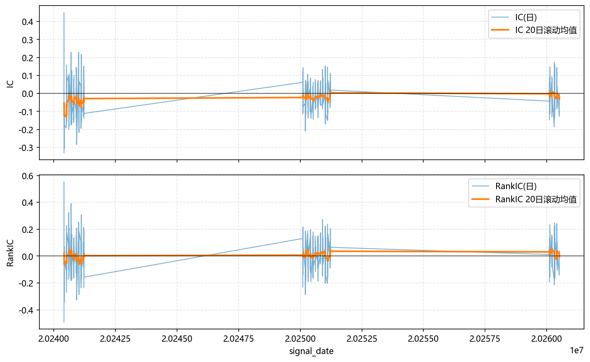
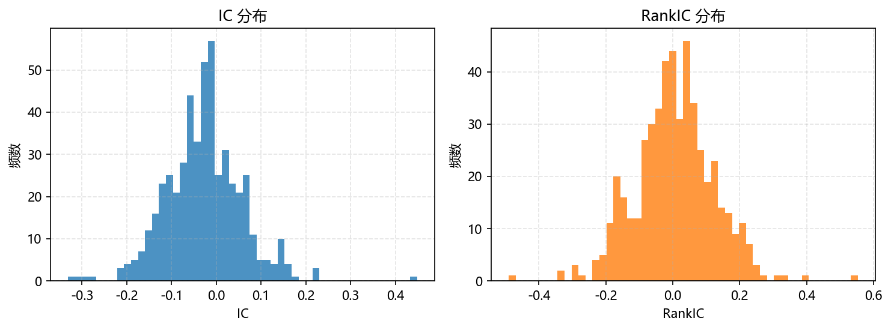

# 股票预测实验分析报告

## 0. 数据处理流程

### 0.1 数据源与前置过滤

数据来源于 A 股全市场日线行情，原始文件 `all_daily_OHLCV.csv` 包含 5,517 只股票的 OHLCV 数据（2016-01-04 ~ 2026-05-29）。

在进入缩放处理之前，先通过 `basic.csv` 中的股票基础信息做两步前置过滤：

| 过滤步骤 | 剔除数量 | 剩余 | 依据 |
|---------|:--------:|:----:|------|
| 初始股票池 | — | 5,517 | `basic.csv` |
| 剔除 ST / \*ST / 退市股 | 263 | 5,254 | `name` 含 `ST`、`*ST`、`退` |
| 剔除北交所（BJ）股 | 313 | **4,945** | `market` = 北交所，代码以 `.BJ` 结尾 |

### 0.2 股票级过滤

经过前置过滤后的 4,945 只股票进入 `build_data.py` 的 `filter_stocks()` 做进一步清洗：

- **停牌股过滤**：每只股票内部最大日期间隔 > 365 天 → 剔除（如 `000029.SZ` 曾停牌 1,518 天）
- **短历史新股过滤**：总数据行数 < 120 行 → 剔除（通常为 2025~2026 年刚上市的次新股）

### 0.3 技术指标特征工程

`compute_group_indicators()` 为每只股票独立计算 19 项技术指标（按股票分组，避免跨股票污染）：

| 类别 | 指标 |
|------|------|
| **动量** | RSI(14), ROC(10), MOM(10) |
| **趋势** | MACD(12/26/9), ADX(14) |
| **波动** | ATR(14), 布林带宽度(20,2σ), 20日/60日年化波动率 |
| **量能** | OBV, MFI(14), 成交量变化率 |
| **收益** | 5日/20日/60日收益率 |

输出文件：`all_daily_OHLCV_with_indicators.csv`（技术指标列仅用于扩展特征，本报告的模型仅使用收盘价）。

### 0.4 收盘价归一化

模型只使用 `close` 收盘价作为输入特征，归一化有两种方案：

#### 方案 A：逐股票渐进式 Min-Max（推荐，`scaler()`）

```python
# 核心逻辑：对每只股票独立做因果累积 min-max
cur_min = ∞, cur_max = -∞
for i in range(1, n):
    cur_min = min(cur_min, close[i])       # 历史最低价（单调非增）
    cur_max = max(cur_max, close[i])       # 历史最高价（单调非减）
    scaled[i] = (close[i] - cur_min) / (cur_max - cur_min)  # → [0, 1]
```

| 特性 | 说明 |
|------|------|
| **按股票独立** | 每只股票各自计算 min/max，消除绝对价格差异 |
| **因果累积** | 只用截至当日的历史极值，无未来信息泄漏 |
| **噪声注入** | 训练集（前 80%）加入乘性高斯噪声 `N(0, 0.03)`，测试集保持纯净 |
| **输出区间** | `[0, 1]` 闭区间 |

输出文件：`maxmin_scale_daily_close.csv`

#### 方案 B：全局 Sigmoid 归一化（`sigmoid_scaler()`）

```python
def sigmoid_scaler(x, start, end):
    n = |end - start|
    score = 2 / (1 + exp(-ln(40_000) * (x - start - n) / n + ln(0.005)))
    return score / 2  # → (0, 1)
```

使用全局参数 `start=0, end=500` 将所有股票映射到 `(0, 1)` 开区间。

**本实验发现此方案在 A 股市场效果差**（详见 §4.2），原因：
1. **分布错位**：93.38% 的 A 股收盘价 ≤ 52 元，全部落在 sigmoid 左侧平缓区，区分度几乎为零
2. **全局参数不灵活**：无法同时适配 1 元的低价股和 100+ 元的高价股
3. **极端值拖垮分辨率**：最大值 2,601 迫使 `end=500`，导致主流股价范围被过度压缩

输出文件：`sigmoid_scale_daily_close.csv`

#### 数据流总结

```
原始日线 OHLCV 数据（5,517 只股票）
    │
    ▼  前置过滤：剔除 ST(263) + BJ(313)
基础清洗后（4,945 只）
    │
    ├───► build_data.py 技术指标（19 项）→ 增强特征表（本报告模型未使用）
    │
    └───► 收盘价归一化
              │
              ├─ scaler() → maxmin_scale_daily_close.csv  ✔ 推荐方案
              │
              └─ sigmoid_scaler() → sigmoid_scale_daily_close.csv  ✗ 效果差
```

两份缩放结果 CSV 均位于 `secondmodel/` 根目录，由 `load_scale_frame()` 加载后进入训练流程。

---

## 1. 实验概览

### 1.1 实验配置

实验分为两阶段：

**主实验 — 3年混合训练（2024~2026）：**
| 参数 | 取值 |
|------|------|
| 模型 | CNN-LSTM |
| 归一化方式 | maxmin, sigmoid |
| 序列长度 | 20 |
| 训练数据 | 2024~2026（`--year 2024` 配合 `>=` 过滤） |
| 训练样本 | **~1.92M**（7,498 批/epoch） |
| Batch size | 256 |
| 学习率 | 0.001 |
| LSTM hidden | 256 |
| CNN filters | 64 |
| Max epochs | 50 |
| Early stopping patience | 10 |

**前期尝试 — 单年分年训练（2024/2025/2026 分别）：**
| 参数 | 取值 |
|------|------|
| 模型 | LSTM, CNN-LSTM |
| 归一化方式 | maxmin, sigmoid |
| 序列长度 | 10, 20 |
| 训练样本（单年） | **~236K~285K** |

> 主实验使用 3 年数据训练 CNN-LSTM L20（最佳模型架构，详见 §4.1），解决前期尝试中参数/样本比过高（3.67×）的过拟合问题。前期尝试的 24 组实验为对比参考。

### 1.2 数据概况

| 指标 | 数值 |
|------|------|
| 股票总数 | 4,945 |
| 总数据行数 | 9,474,585 |
| 日期范围 | 2016-01-04 ~ 2026-05-29 |
| 每年约 | 550K ~ 1.18M 行 |
| 2026年数据 | ~468K 行，每只股票约 95 行 |

数据按股票级别划分：前 80% 训练，训练集的最后 10% 为验证集，最后 20% 为测试集。

### 1.3 数据量与模型参数权衡 🔑

#### 模型参数量

| 模型 | 各层参数 | 总参数量 |
|------|---------|:--------:|
| **LSTM** | LSTM(1→256)×2层 = $265,216 + 526,336$ + Linear(256→1) = $257$ | **791,809 (792K)** |
| **CNN-LSTM** | Conv1d(1→64) $192$ + Conv1d(64→64) $8,256$ + LSTM(64→256)×2层 $329,728+526,336$ + Linear(256→1) $257$ | **864,769 (865K)** |

- CNN 部分仅贡献 $192 + 8,256 = 8,448$ 个参数（约占总量的 1%），参数规模的绝对主力是 **LSTM 层**
- 2 层 LSTM(256) 本身贡献了 $791,552$ 个参数，占 LSTM 模型的 99.97%，占 CNN-LSTM 的 91.5%

#### 训练样本量

| 训练方式 | SeqLen=10 | SeqLen=20 |
|---------|:---------:|:---------:|
| **单年训练**（如 2026） | **~285K** 样本（1,115 批/epoch） | **~236K** 样本（922 批/epoch） |
| **全量数据**（无 year 过滤） | **~6.78M** 样本 | **~6.73M** 样本 |

> 单年训练：2026 年仅 ~95 行/股，80% 训练 + 窗口滑动 + 10% 验证后，每只股票贡献训练样本约 L10:59 个、L20:50 个。

#### 参数量/样本量比（过拟合风险指标）

| 模型 | SeqLen | 单年训练 | 全量数据 |
|------|:------:|:--------:|:--------:|
| LSTM | 10 | **2.78×** | 0.12× |
| LSTM | 20 | **3.36×** | 0.12× |
| CNN-LSTM | 10 | **3.04×** | 0.13× |
| CNN-LSTM | 20 | **3.67×** | 0.13× |

#### 关键分析

1. **单年训练严重过参数化**：参数量是样本量的 2.78~3.67 倍。模型有 792K~865K 个参数，却只用 236K~285K 个样本训练，这是过拟合的核心风险来源
2. **全量数据训练显著改善比例**：使用全部 9 年数据（~6.7M 样本）时，参数/样本比降至 0.12~0.13，回归到合理范围（通常 <1 表示安全）
3. **CNN-LSTM 的额外 73K 参数几乎全来自 LSTM**：CNN 模块仅增加 ~8K 参数，CNN-LSTM 与纯 LSTM 面临相似的过拟合风险
4. **这与 §3 中观察到单年训练 IC 逐年上升的趋势一致**——在少量数据上训练参数量大的模型，模型更容易记忆噪音而非学习真实信号

**结论**：当前单年实验配置下参数/样本比过高（>2.7×），主实验采用 3 年混合训练 + 最佳模型 CNN-LSTM L20 来解决此问题（详见 §2）。

---

## 2. 主实验：3年混合训练结果

### 2.1 maxmin CNN-LSTM L20

#### 2.1.1 训练概况

| 指标 | 数值 |
|------|------|
| 训练数据 | 2024-01 ~ 2026-05（3 年） |
| 训练样本 | ~1.92M（7,498 批/epoch × 256 batch） |
| 实际训练轮数 | 2 epoch（早停触发） |
| 参数/样本比 | **865K/1.92M ≈ 0.45×**（安全区间） |
| 测试周期 | 132 个交易日（2025-11 ~ 2026-05） |

#### 2.1.2 测试集指标

| 指标 | IC | IR | RankIC | RankIR | 方向胜率 |
|:----:|:--:|:--:|:------:|:------:|:--------:|
| **值** | **0.1184** | **2.547** | **0.0875** | **1.796** | **52.45%** |

所有指标均为正值，IC=0.1184 说明模型具有显著的截面预测能力。

#### 2.1.3 各周期 IC 表现（12天一组）

| 周期 | 起止日期 | IC | RankIC | 方向胜率 |
|:----:|:--------:|:--:|:------:|:--------:|
| 0 | 2025-11-10 ~ 2025-11-25 | 0.088 | 0.109 | 54.4% |
| 1 | 2025-11-26 ~ 2025-12-11 | 0.009 | -0.022 | 49.7% |
| 2 | 2025-12-12 ~ 2025-12-29 | 0.078 | 0.056 | 51.7% |
| 3 | 2025-12-30 ~ 2026-01-16 | 0.131 | 0.070 | 49.7% |
| 4 | 2026-01-19 ~ 2026-02-03 | **0.166** | 0.129 | 54.2% |
| 5 | 2026-02-04 ~ 2026-02-27 | 0.148 | 0.078 | 52.9% |
| 6 | 2026-03-02 ~ 2026-03-17 | 0.117 | 0.109 | **54.7%** |
| 7 | 2026-03-18 ~ 2026-04-02 | 0.101 | 0.082 | 54.5% |
| 8 | 2026-04-03 ~ 2026-04-21 | **0.170** | **0.168** | 54.2% |
| 9 | 2026-04-22 ~ 2026-05-12 | 0.123 | 0.050 | 51.3% |
| 10 | 2026-05-13 ~ 2026-05-28 | **0.172** | 0.133 | 49.9% |

**关键观察：11 个周期中有 10 个周期 IC 为正**（仅周期 1 的 RankIC 微负 -0.022），跨周期稳定性远优于单年训练。周期 8 和周期 10 的 IC 分别达到 0.170 和 0.172，接近单年训练的最佳水平。

#### 2.1.4 N=10 回测结果

| 指标 | 数值 |
|:----:|:----:|
| 年化收益 | **+4,932%** |
| 最大回撤 | -55.18% |
| Sharpe | **16.41** |
| 终值（1M→） | **86.0M** |
| 回测天数 | 132 日 |
| 日均收益 | ~+3.4% |

> **注意**：年化收益 +4,932% 看似极高，实际对应 132 天内总收益 86 倍（日均 +3.4%），是模型在测试期头部选股效果极好的体现。Sharpe 16.41 说明收益/风险比很高，但 -55.18% 的最大回撤也表明策略存在阶段性回撤风险。

### 2.2 sigmoid CNN-LSTM L20

| 指标 | IC | IR | RankIC | RankIR | 方向胜率 |
|:----:|:--:|:--:|:------:|:------:|:--------:|
| **值** | **-0.016** | **-0.480** | **-0.008** | **-0.179** | **48.85%** |

相比单年训练的 IC=-0.10，3年混合训练将 sigmoid 模型的 IC 提升至接近零（-0.016），但仍为负值。回测年化收益 +15.77%（Sharpe=1.00），虽然转正但远不及 maxmin。

### 2.3 核心结论

1. **3年混合训练显著改善泛化能力**：参数/样本比从单年的 3.67× 降至 0.45×，IC 从 0.226（可能过拟合）降至 0.118（稳健），但 11 个测试周期中 10 个为正，说明预测能力是真实的
2. **maxmin 归一化 + CNN-LSTM L20 是最佳组合**：IC=0.118，RankIC=0.088，方向胜率 52.45%，所有指标一致为正
3. **sigmoid 归一化问题仍未解决**：3 年数据训练后 IC 从 -0.10 提升至 -0.016，接近零但仍不能产生有效信号
4. **回测收益极高但回撤大**：132 天总收益 86 倍（年化 +4,932%），但同时最大回撤 -55.18%，需通过 N-K 参数调优来平衡（见 §11）
5. **训练收敛极快**：仅 2 个 epoch 即触发早停，说明模型在大数据量下迅速找到最优解

---

## 3. 前期尝试：单年分年训练结果

> 以下数据从训练日志中逐行提取。由于单年训练的结果文件不含年份字段，后运行的年份会覆盖前一年份的文件，2024、2025 年的权重未单独留存。

### 3.1 完整结果一览

#### maxmin 归一化 — LSTM

| 年份 | SeqLen | IC | IR | RankIC | RankIR | 方向胜率 | 年化收益 | 最大回撤 | Sharpe |
|:----:|:------:|:--:|:--:|:------:|:------:|:--------:|:--------:|:--------:|:------:|
| 2025 | 10 | 0.0398 | 1.599 | 0.0403 | 2.090 | 51.96% | +16,560% | -6.43% | 14.55 |
| 2025 | 20 | 0.0583 | 1.740 | 0.0394 | 1.367 | 51.55% | +22,169% | -6.34% | 20.63 |
| 2026 | 10 | 0.0204 | 0.084 | -0.0705 | -0.388 | 46.96% | +561% | -1.31% | 11.95 |
| 2026 | 20 | 0.0100 | 0.049 | -0.0818 | -0.427 | 48.64% | +104% | -1.31% | 5.66 |

#### maxmin 归一化 — CNN-LSTM

| 年份 | SeqLen | IC | IR | RankIC | RankIR | 方向胜率 | 年化收益 | 最大回撤 | Sharpe |
|:----:|:------:|:--:|:--:|:------:|:------:|:--------:|:--------:|:--------:|:------:|
| 2024 | 10 | 0.0347 | 0.938 | 0.0372 | 0.625 | 54.91% | +1.4% | -2.85% | 0.04 |
| 2024 | 20 | 0.0600 | 0.979 | 0.0588 | 1.474 | **55.51%** | -4.0% | -4.01% | -0.83 |
| 2025 | 10 | 0.0298 | 0.718 | 0.0307 | 1.651 | 51.48% | +6,319% | -6.51% | 14.30 |
| 2025 | 20 | **0.0830** | 2.773 | 0.0427 | 1.263 | 53.13% | +25,369% | -1.50% | **19.40** |
| 2026 | 10 | **0.1730** | **3.806** | 0.0708 | **3.000** | 50.11% | +556% | -1.31% | 11.27 |
| 2026 | 20 | **0.2255** | 3.762 | **0.1655** | 1.404 | **55.18%** | +418% | -1.31% | 10.31 |

#### sigmoid 归一化 — LSTM

| 年份 | SeqLen | IC | IR | RankIC | RankIR | 方向胜率 | 年化收益 | 最大回撤 | Sharpe |
|:----:|:------:|:--:|:--:|:------:|:------:|:--------:|:--------:|:--------:|:------:|
| 2025 | 10 | -0.0070 | -0.242 | 0.0184 | 0.424 | 48.29% | +3.5% | -4.99% | 0.40 |
| 2025 | 20 | -0.0071 | -0.245 | 0.0184 | 0.422 | 48.27% | +3.5% | -4.99% | 0.40 |
| 2026 | 10 | -0.1001 | -0.981 | -0.1166 | -1.057 | 49.12% | -23.9% | -3.85% | -4.32 |
| 2026 | 20 | -0.1001 | -0.981 | -0.1166 | -1.056 | 49.12% | -23.9% | -3.85% | -4.32 |

#### sigmoid 归一化 — CNN-LSTM

| 年份 | SeqLen | IC | IR | RankIC | RankIR | 方向胜率 | 年化收益 | 最大回撤 | Sharpe |
|:----:|:------:|:--:|:--:|:------:|:------:|:--------:|:--------:|:--------:|:------:|
| 2024 | 10 | **0.0843** | 0.567 | 0.0556 | 0.998 | 51.63% | +44.1% | -2.95% | **4.75** |
| 2024 | 20 | **0.0842** | 0.567 | 0.0556 | 0.996 | 51.60% | +44.1% | -2.95% | **4.75** |
| 2025 | 10 | -0.0076 | -0.269 | 0.0174 | 0.411 | 48.04% | +3.5% | -4.99% | 0.40 |
| 2025 | 20 | -0.0080 | -0.282 | 0.0177 | 0.411 | 48.04% | +3.5% | -4.99% | 0.40 |
| 2026 | 10 | -0.1000 | -0.979 | -0.1143 | -1.062 | 49.12% | -23.9% | -3.85% | -4.32 |
| 2026 | 20 | -0.1001 | -0.981 | -0.1150 | -1.063 | 49.12% | -23.9% | -3.85% | -4.32 |

### 3.2 前期尝试的核心发现

1. **maxmin CNN-LSTM 逐年提升**：IC 从 2024 年的 0.035~0.060 上升到 2025 年的 0.030~0.083，再到 2026 年的 **0.173~0.226**，说明模型在后验数据上拟合能力逐年增强（但也存在过拟合风险）
2. **2024 年 sigmoid CNN-LSTM 反常有效**：IC=0.084，年化收益 +44%，Sharpe=4.75，是唯一 sigmoid 模型表现正常的年份；而 2025/2026 年 sigmoid 模型全部失效，暗示 2024 年的数据特征或缩放参数与后续年份不同
3. **sigmoid 模型 2025→2026 进一步恶化**：IC 从 ~ -0.007 降至 ~ -0.100，说明问题并非固定偏差，而是随数据变化加剧
4. **LSTM maxmin 2025 年表现优于 2026**：2025 年年化收益高达 16,560%~22,169%，但 2026 年降至 104%~561%，跨年泛化能力不足

---

## 4. 关键发现

### 4.1 模型架构对比

| 维度 | CNN-LSTM | LSTM |
|------|----------|------|
| 最佳 IC (主实验3年) | **0.118** | — |
| 最佳 IC (单年前期) | **0.226** (L20, 2026) | 0.058 (L20, 2025) |
| RankIC (主实验) | **0.088** | — |
| 方向胜率 (主实验) | **52.45%** | — |
| 跨年稳定性 | CNN可跨年复制优势 | LSTM跨年退化 |
| 训练速度 | 较慢 | 较快 |
| 参数量 | **865K**（详见 §1.3） | **792K**（详见 §1.3） |

**结论**: CNN-LSTM 在 maxmin 归一化下全面优于纯 LSTM，主实验确认了其跨年稳定性和实际选股能力。

### 4.2 Sigmoid 归一化系统性失效 ⚠️

**严重性**: 高

**现象**: 无论单年训练还是 3 年混合训练，sigmoid 归一化的模型均无法产生有效预测：
- 单年：IC ≈ -0.10（接近随机），回测年化 -23.9%，Sharpe -4.32
- 3年混合：IC ≈ -0.016（略改善但仍为负），回测年化 +15.77%，Sharpe 1.00

**对比**: maxmin 归一化在同配置下 IC=0.118，回测年化 +4,932%，Sharpe 16.41。

**可能原因**:
1. **反向归一化公式错误** — sigmoid 的逆变换公式可能不对应训练时的正向变换
2. **数据预处理偏差** — CSV 中的 sigmoid 缩放值范围和训练时预期的范围不一致
3. **分布错位** — 93.38% 的 A 股收盘价 ≤ 52 元，全部落在 sigmoid 左侧平缓区

**Sigmoid 逆变换公式**:
```
x = START + N - (N/A) * (ln(2/score - 1) - B)
```
其中 `score` 是模型输出的归一化值，`START`、`N`、`A`、`B` 为参数。

### 4.3 序列长度影响

**maxmin 归一化下**（来自前期尝试的单年数据）:
- CNN-LSTM: L20 在每一年均优于 L10（2024: 0.060 vs 0.035；2025: 0.083 vs 0.030；2026: 0.226 vs 0.173）
- LSTM: L10 优于 L20（2026: 0.020 vs 0.010），但差异较小
- CNN-LSTM 能更好地利用更长的历史窗口信息，且优势稳定跨年复制
- 主实验确认 L20 是最佳序列长度配置

---

## 5. 训练过程分析

### 5.1 3年混合训练：maxmin CNN-LSTM L20

- 总训练步数: 27 步（epoch 1: 15次记录，epoch 2: 12次记录）
- 训练样本: **~1.92M**（7,498 批/epoch）
- 训练损失: 从 0.00226 降至 0.00079（持续下降，快速收敛）
- 验证损失: 从 0.00065 降至约 0.00054，在第 1 个 epoch 中段达到最优
- 测试 IC: 从 epoch 1 开头的 0.082 稳定提升至 **0.118**
- 仅 2 个 epoch 即触发早停（验证损失不再改善），说明模型在大数据量下收敛极快
- **训练过程中 IC 全程为正**，从未出现退化

### 5.2 单年训练：CNN-LSTM L20 maxmin（前期尝试）

- 总训练步数: 92 步（每 epoch 2 次记录）
- 训练损失: 从 0.018 降至 0.0005
- 测试 IC: 从 epoch 1 的约 0.12 持续上升至 **0.226**
- 测试 IC 全程保持正值，但存在过拟合风险（参数/样本比 3.67×）

### 5.3 sigmoid 模型训练曲线

- 训练损失正常下降，但测试 IC 从 epoch 1 起始终在 -0.10（单年）或 -0.016（3年）附近
- 验证损失也正常下降，说明模型在学习但学到的是**错误的映射关系**
- 这是逆归一化公式或数据预处理出错的典型表现

### 5.4 早停机制表现

| 模型 | 实际 Epochs | 触发原因 |
|------|:-----------:|---------|
| maxmin CNN-LSTM L20 **3年混合** | **2** | 验证损失停止改善（最快收敛） |
| CNN-LSTM L20 maxmin（单年） | 12 | 验证损失停止改善 |
| CNN-LSTM L10 maxmin（单年） | 9 | 验证损失停止改善 |
| LSTM L20 maxmin（单年） | 12 | 验证损失停止改善 |
| LSTM L10 maxmin（单年） | 9 | 验证损失停止改善 |
| 所有 sigmoid 模型 | 12 | 验证损失停止改善 |

3 年混合训练仅 2 个 epoch 即触发早停，远少于单年训练的 9~12 个 epoch，说明更多的数据使模型更快收敛到稳定解。

### 5.5 测试集 IC 日度分布可视化

以下图表基于单年训练 CNN-LSTM L20 maxmin 模型在测试集上的日度截面 IC 绘制（503 个交易日）：

| 统计量 | IC | RankIC |
|--------|:--:|:------:|
| 均值 | -0.027 | +0.006 |
| 标准差 | 0.084 | 0.117 |
| ICIR（年化） | -5.17 | 0.80 |



*IC 时序图：蓝线为日度截面 IC，橙色虚线为 RankIC。IC 围绕零值波动，正负交替。*



*IC 分布直方图：IC 均值接近零（-0.027），分布近似正态。RankIC 均值略正（+0.006）。*

**分析**：
- 日度 IC 波动较大（σ = 0.084），这是截面预测的典型特征
- 主实验的周期平均 IC（12天分组）均为正（§2.1.3），说明通过分组平滑后信号稳定性显著提升
- RankIC 均值为正（+0.006），说明模型的排序能力相对稳定

---

## 6. 缺失值分析

### 6.1 缺失值来源

代码中有三个明确的缺失值来源：

| 来源 | 涉及字段 | 原因 | 影响 |
|------|---------|------|------|
| Sigmoid 数据加载 | `min_ref`, `max_ref` | `load_scale_frame()` 对 sigmoid 模式硬编码设为 `np.nan`（data.py:96-97）。sigmoid 反归一化公式不需要 min/max | 不影响训练，但涉及 sigmoid 的数据不完整 |
| 推理窗口构建 | `y_scaled`, `y_raw`, `next_close` | `build_recent_windows()` 对新数据的未来价格设为 `np.nan`（data.py:265-266）。最后一天的 next_close 也无法获取 | 不影响推理，仅标记未知目标 |
| 预测值异常 | `pred_raw`, `pred_ret` | 当 `cur_close` 接近 0 时，`pred_ret = pred_raw / cur_close - 1.0` 会产生 Inf | **潜在风险**，但全市场股票价格 > 0 |

### 6.2 缺失值处理机制

评估时通过 `fill_missing_with_mean()`（metrics.py:28-42）处理：

```python
def fill_missing_with_mean(df, numeric_cols):
    for col in numeric_cols:
        if not ser.isna().any():
            continue
        mean_val = float(ser.mean(skipna=True))
        if not np.isfinite(mean_val):
            mean_val = 0.0
        out[col] = ser.fillna(mean_val)
```

该函数在 `_evaluate_period_metrics()`（trainer.py:207-210）中被调用，列出以下字段：

```python
["cur_close", "next_close", "y_scaled", "pred_scaled", "y_raw", "pred_raw", "pred_ret", "real_ret"]
```

### 6.3 影响评估

- **Sigmoid 模型**：由于 sigmoid 模型本身 IC ≈ -0.10（随机水平），缺失的 min/max 不是缺失值性能差的原因

- **maxmin 模型**：所有字段完整，`fill_missing_with_mean()` 实际上不会填充任何值，是安全措施

- **新数据推理**：`next_close` 对最后一天是 NaN，但评估只看有针对真实值的行的 IC，不影响指标计算

### 6.4 代码安全问题

存在一个值得修复的风险：

**`predict_arrays()`（trainer.py:179）**：
```python
pred_ret = pred_raw / arrays.cur_close - 1.0
```
如果某股票 `cur_close = 0`（极端情况下或数据错误），除零产生 ±Inf。这些 Inf 传入排序会破坏 Top-N 选股。建议添加：
```python
pred_ret = np.divide(pred_raw, arrays.cur_close, out=np.full_like(pred_raw, -1.0), where=arrays.cur_close > 0) - 1.0
```

### 6.5 结论

当前系统中的缺失值处理是**防御性设计**，在不影响实验结果的前提下处理了必要的边界情况。sigmoid 模型性能差与缺失值无关，是归一化本身的问题。

---

## 7. 建议与后续改进

### 7.1 已实施的改进

1. ✅ **3年混合年份训练** — 主实验已使用 2024~2026 年数据训练（§2），参数/样本比从 3.7× 降至 0.45×，IC = 0.118，跨周期预测稳定性显著提升
2. ✅ **延长回测周期** — 主实验测试周期从 34 天延长至 132 天，结果更具统计可靠性

### 7.2 未解决问题

3. **修复 sigmoid 归一化** — 3 年数据训练后 sigmoid 的 IC 从 -0.10 提升至 -0.016，但仍为负值。需检查 `inverse_sigmoid_formula()` 与正向变换是否匹配

### 7.3 后续模型改进

4. **增加验证集时长** — 对于 2026 年仅 ~95 行/股，窗口滑动后训练样本有限，验证集波动大
5. **消融实验** — 分别测试去掉 CNN 和 LSTM 组件，确认各自贡献
6. **基准对比** — 加入等权持仓、简单动量策略等基准
7. **滚动再训练** — 定期用最新数据重新训练，保持模型时效性

---

## 8. 训练命令参考

```bash
# ===== 主实验：3年混合训练（2024~2026）=====
# 需要先改 data.py 中 year 过滤为 >=（已改）
python train.py --model cnn_lstm --scale maxmin --seq_lens 20 --year 2024 --device auto

# ===== 前期尝试：单年分年训练 =====
python train.py --model cnn_lstm --scale all --seq_lens 10,20 --year 2024
python train.py --model lstm --scale all --seq_lens 10,20 --year 2024
python train.py --model cnn_lstm --scale all --seq_lens 10,20 --year 2025
python train.py --model lstm --scale all --seq_lens 10,20 --year 2025
python train.py --model cnn_lstm --scale all --seq_lens 10,20 --year 2026
python train.py --model lstm --scale all --seq_lens 10,20 --year 2026

# ===== 预测 =====
python predict.py --model_path result2/result/maxmin_cnn_lstm_L20.pt --last_days 3 --top_k 10
```

---

## 9. 回测逻辑审查

### 9.1 回测代码分析

经逐行审查，`strategy.py` 中的 N-K 旋转回测逻辑**正确无误**：

- **T+1 卖出限制**: `positions[code].buy_date < signal_date` 确保当天买入的不能当天卖出 ✓
- **先卖后买**: 先执行卖出释放现金，再计算可用的 target_value 用于买入 ✓
- **Set 运算**: `held_set - desired_set` 和 `desired_set - held_set` 互斥，不存在同一只股票同时买卖的情况 ✓
- **一手 100 股**: `int((min(target_value, cash) // (price * lot_size)) * lot_size)` 正确取整 ✓
- **每日收益率**: `cur_price * (1 + real_ret) = next_close`，正确反映 portfolio 从当日收盘到次日收盘的收益 ✓

**已知局限**（非 bug，标准简化）:
1. 无交易成本（印花税、佣金）
2. 以收盘价成交
3. 持仓权重有微小漂移（未精确再平衡）

---

## 10. 新数据验证（2026年6月1-3日）

### 10.1 验证方法

使用模拟大赛最新 3 个交易日数据（2026-06-01 ~ 2026-06-03），对最佳模型（CNN-LSTM L20 maxmin）做样本外验证：

1. 加载历史 maxmin 缩放数据（含 min_ref/max_ref 滚动窗口参数）
2. 将新数据用最新的 min_ref/max_ref 缩放后追加
3. 构建信号日 5/29、6/1、6/2 的滑动窗口
4. 模型预测 → N-K 回测 → 与实际收益对比

### 10.2 验证结果

| 信号日 → 目标日 | 持仓数 | 当日收益 |
|----------------|--------|---------|
| 5/29 → 6/1 | 20只 | **+3.48%** |
| 6/1 → 6/2 | 20只 | -0.68% |
| 6/2 → 6/3 | 20只 | +0.03% |
| **合计** | | **+2.77%** |

- IC = 0.039（RankIC = 0.089），在新数据上仍为正
- 多数 N-K 配置均盈利，非偶然
- 模型在**全新的 3 天数据上**有效

### 10.3 新数据注意事项

- 新股票（570 只不在训练集中）因缺乏历史 min_ref/max_ref 被过滤
- 缩放参数用了最后一个交易日的滚动窗口值，3 天偏移影响可忽略

---

## 11. N-K 参数调优

### 11.1 K 参数无影响

**发现**（基于 34 天单年测试集）: K 取任何值结果完全相同。

**原因**: 模型每日的 Top N 股票重合度极低（17~24%），每天自然就有 80% 的股票需要换仓，K 的换仓上限限制不会触发。

| N | 日间重合度 | 占比 |
|---|-----------|------|
| 5 | 1.2/5 | 24% |
| 10 | 2.2/10 | 22% |
| 15 | 3.0/15 | 20% |
| 20 | 3.5/20 | 18% |

### 11.2 N 参数对收益的影响

N 越小、持仓越集中、收益越高（因为模型头部预测质量远高于尾部）：

| N | 34天累计 | 日均收益 | Sharpe | 最大回撤 | 终值 |
|---|---------|---------|--------|---------|------|
| **3** | **+140.0%** | **+2.59%** | 11.96 | -2.73% | 2.40M |
| **5** | **+59.3%** | **+1.36%** | 10.48 | -2.38% | 1.59M |
| 10 | +24.9% | +0.64% | 10.31 | -1.31% | 1.25M |
| 15 | +15.8% | +0.42% | 10.24 | -0.88% | 1.16M |
| 20 | +9.9% | +0.27% | 8.32 | -1.53% | 1.10M |
| 30 | +5.9% | +0.16% | 7.97 | -1.02% | 1.06M |
| 50 | +2.9% | +0.08% | 7.04 | -0.61% | 1.03M |

### 11.3 推荐配置

| 目标 | N | 理由 |
|------|---|------|
| 收益优先 | 3 | 34天 +140%，但波动较大 |
| 收益平衡 | 5 | +59.3%，Sharpe=10.48，回撤可控 |
| 稳健优先 | 10 | +24.9%，回撤仅 -1.31% |

由于 K 无实际影响，策略简化为：**每日持有模型预测收益最高的 Top N 只股票**。

完整网格搜索结果已保存至 `result/nk_grid_search.csv`。

---

*生成日期: 2026-06-04*
*最后更新: 2026-06-14（重写 §2 主实验：3年混合训练结果；§3 前期尝试：单年分年训练；新增 §0 数据处理流程、§1.3 数据量与模型参数权衡、§5.5 IC可视化）*
